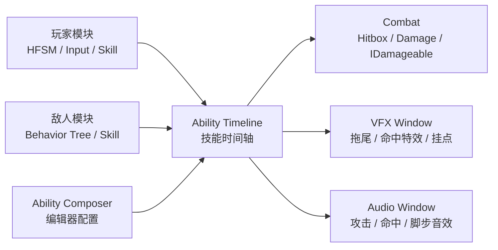

# Protocol-Evac

> 3D Unity 动作撤离项目，当前重点为角色动作战斗、敌人 AI、技能编辑器与战斗表现配置。

## 项目简介

> Protocol-Evac 是一个以 3D 动作战斗为核心的 Unity 项目原型。项目目前围绕“玩家操作 - 敌人 AI - 技能时间轴 - 命中判定 - 特效音效反馈”这一条完整战斗链路展开，实现了玩家三段普攻、翻滚、受击死亡、敌人巡逻追击攻击，以及**可视化技能配置工具 Ability Composer**。

## 技术栈与核心架构

- **引擎与渲染**：Unity 2022.3.62f3，Universal Render Pipeline
- **输入系统**：Unity Input System，封装玩家输入读取、输入缓存与疾跑解释
- **角色架构**：玩家使用 HFSM 分层有限状态机，拆分移动、空中、动作、技能、受击等状态
- **敌人 AI**：基于 Behavior Tree 实现巡逻、索敌、追击、攻击等待与普通攻击
- **战斗架构**：通过 `CombatHitbox`、`DamageData`、`IDamageable` 形成统一命中与受击协议，降低玩家与敌人之间的直接耦合
- **技能架构**：自研 Ability Composer，以动画时间轴为核心配置命中窗口、连段推进、移动锁定、特效窗口与音效窗口
- **资源管理**：接入 Addressables（AA 包），音效与表现资源可通过配置引用
- **编辑器工具**：使用 Unity EditorWindow / UI Toolkit 制作技能编辑器，支持预览、窗口编辑、挂点选择与配置保存
- **表现系统**：VFX 窗口支持武器拖尾、命中特效、挂点生成；Audio 窗口支持攻击、命中、脚步等音效，并支持数组随机播放

## 核心模块

```text
Assets/Scripts/
├─ Module/
│  ├─ Player/              # 玩家控制、输入、HFSM、技能、受击
│  ├─ Enemy/               # 敌人 AI、移动、动画、技能、受击
│  ├─ Combat/              # 命中盒、伤害数据、受击协议
│  ├─ Navigation/          # 导航相关逻辑
│  └─ Timer/               # 计时工具
├─ Tools/
│  └─ AbilityComposer/     # 技能编辑器、窗口数据与运行时控制器
└─ Framework/              # 项目基础框架与通用能力
```

## 系统关系



## 当前已实现

- 玩家移动、疾跑、翻滚、三段普攻、受击与死亡
- 敌人巡逻、追击、攻击、受击与死亡
- 玩家与敌人的近战命中判定
- 技能时间轴配置：命中窗口、连段窗口、移动锁定窗口
- 特效配置：武器拖尾、命中特效、挂点选择
- 音效配置：攻击音效、命中音效、脚步随机音效
- 本地 Ability Composer 编辑器工具

## 运行环境

- Unity 版本：2022.3.62f3
- 渲染管线：URP
- 主要依赖：Input System、Addressables、UniTask、TriInspector、Fluid Behavior Tree

## 资源说明

仓库主要用于展示代码结构与系统实现。部分动画、美术、VFX、音频等不会随仓库提交，已通过 `.gitignore` 忽略。如果拉取项目后出现资源缺失，需要自行补充对应本地资源。

## 须知

> 仅作为个人学习与技术实践项目。
