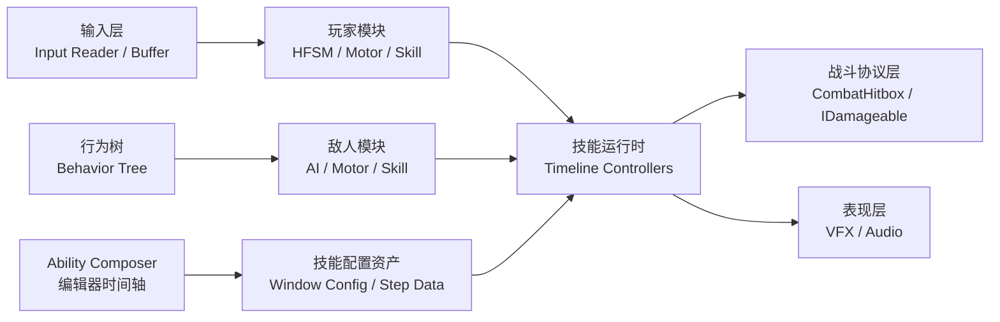
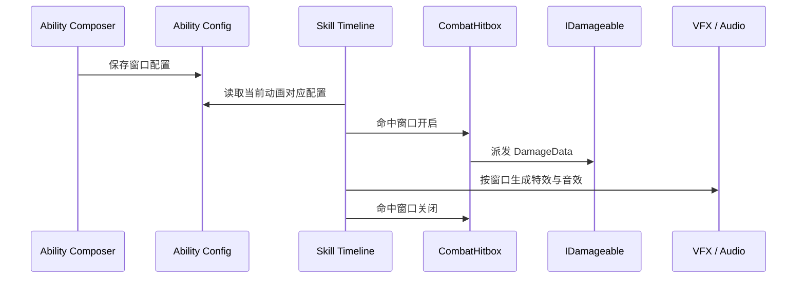

# Protocol-Evac

> 一个以 **3D 动作战斗、角色状态机、敌人 AI 与技能编辑器工具链** 为核心的 Unity 学习型项目。  
> 当前项目重点不是堆玩法数量，而是把“角色动作 - 战斗判定 - 特效音效 - 编辑器配置”这条生产链路打通。

## 🎬 项目演示

演示视频整理中。

如果用于课程展示或阶段汇报，推荐展示顺序：

1. 玩家移动、翻滚、三段普攻与受击死亡
2. 敌人巡逻、追击、攻击与受击反馈
3. Ability Composer 技能编辑器：命中窗口、特效窗口、音效窗口
4. 修改配置后回到运行时验证攻击判定、VFX、SFX 是否生效

## 📌 项目简介

Protocol-Evac（撤离协议）是一个 3D Unity 动作项目原型，目前围绕角色战斗系统进行纵向开发。项目的核心目标是：让角色的动作表现、战斗判定、敌人行为和表现层资源都能通过清晰的数据配置串起来，而不是把逻辑散落在动画事件、角色脚本和临时 Inspector 字段里。

当前已经形成了一个比较完整的战斗闭环：

- 玩家可以移动、疾跑、翻滚、普攻连段、受击与死亡
- 敌人可以巡逻、索敌、追击、进入攻击距离并触发攻击
- 命中由统一的 `CombatHitbox` 和 `IDamageable` 协议处理
- 技能过程由 Ability Composer 的时间轴窗口驱动
- 攻击判定、连招推进、移动锁定、特效、音效都可以在配置中编辑

## ✨ 当前已实现的核心功能

### 玩家模块

- 基于 HFSM 的玩家状态机
- 移动、停止、跳跃、下落、翻滚、受击、死亡等基础状态
- 三段普攻配置与连招缓冲
- 攻击过程中转向与攻击距离调整
- 输入读取、输入缓存、疾跑解释器
- 玩家受击、死亡和动画表现控制
- 玩家攻击音效、脚步音效、跑步音效与疾跑音效配置

### 敌人模块

- 基于 Behavior Tree 的敌人行为控制
- 巡逻、返回出生点、发现目标、追击、攻击等待与普攻
- 敌人移动控制、动画写入、攻击距离与上前攻击调整
- 敌人受击、死亡、攻击特效与命中音效
- 敌人技能同样复用 Ability Composer 的窗口配置

### 战斗模块

- `DamageData` 统一描述伤害数据
- `IDamageable` 作为受击协议，降低攻击方和受击方耦合
- `CombatHitbox` 负责窗口期内的判定、目标过滤和命中派发
- 玩家与敌人不直接互相依赖，而是通过 Combat 协议交互

### Ability Composer 技能编辑器

- 技能动画预览与时间轴窗口编辑
- 命中窗口：配置攻击判定、伤害、命中目标和命中反馈
- Step 窗口：控制连段推进节点
- Movement Lock 窗口：控制动作期间移动锁定
- VFX 窗口：配置武器拖尾、命中特效、生成目标、挂点 Id
- Audio 窗口：配置攻击、命中、脚步等音效，支持数组随机播放
- 挂点选择器：从角色或武器预制体的 `VfxSocketBinder` 中读取可用挂点
- 支持从合并窗口配置中删除单个窗口，方便持续调参

## 🧱 技术栈

| 类型 | 使用内容 |
| --- | --- |
| 引擎 | Unity 2022.3.62f3 |
| 渲染 | Universal Render Pipeline 14 |
| 输入 | Unity Input System |
| 资源 | Addressables |
| 异步 | UniTask |
| Inspector 增强 | TriInspector |
| AI | Fluid Behavior Tree |
| 编辑器工具 | UI Toolkit、Unity EditorWindow |
| 协作工具 | Unity MCP / Codex 辅助开发 |

## 🧠 核心架构

项目目前更偏“模块化战斗原型”，而不是传统的单体角色控制脚本。我的理解是：战斗系统最容易失控的地方，不是某一个状态写得复杂，而是数据入口太多、表现逻辑太分散。所以这里把运行时和编辑器做了一个明确分层。



### 设计重点

- Player 和 Enemy 不强行共用同一套状态类，只复用底层战斗协议与技能窗口数据
- Combat 层保持小而稳定，只负责“谁打到了谁、造成什么效果”
- Ability Composer 是生产工具，不只是调试工具；它负责把动画帧、判定、特效、音效对齐
- VFX 和 Audio 不写死在角色脚本里，而是作为时间轴窗口参与技能流程
- 先完成一条可运行的纵向链路，再逐步抽象公共能力，避免过早框架化

## ⚔️ 技能窗口数据流



## 📁 项目结构

```text
Protocol_Evac/
├─ Assets/
│  ├─ Scripts/
│  │  ├─ Module/
│  │  │  ├─ Player/              # 玩家输入、状态机、移动、技能、受击
│  │  │  ├─ Enemy/               # 敌人 AI、移动、动画、技能、受击
│  │  │  ├─ Combat/              # 伤害数据、命中盒、受击协议
│  │  │  ├─ Navigation/          # 导航相关模块
│  │  │  └─ Timer/               # 计时工具模块
│  │  ├─ Tools/
│  │  │  └─ AbilityComposer/     # 技能编辑器、窗口数据与运行时控制器
│  │  └─ Framework/              # 项目基础框架与通用能力
│  ├─ Config/
│  │  ├─ Player/                 # 玩家状态、技能、窗口与音频配置
│  │  ├─ Enemy/                  # 敌人行为、技能、窗口配置
│  │  └─ Navigation/             # 导航配置
│  ├─ Prefabs/                   # 角色、武器、特效等预制体
│  └─ Audio/                     # 项目音效资源
├─ Packages/                     # Unity Package 依赖
├─ ProjectSettings/              # Unity 项目设置
└─ README.md
```

## 🚀 运行环境

- Unity：`2022.3.62f3`
- 推荐使用 Unity Hub 打开项目根目录
- 首次打开后等待 Package Manager 解析依赖
- 如果出现资源丢失，优先检查本地美术、动画、VFX、音频资源是否被 `.gitignore` 忽略

## ⚠️ 资源与版权说明

本仓库主要用于展示代码结构、战斗系统实现和编辑器工具链。部分动画、美术、VFX、音频与 AI 协作资料属于本地开发资源或第三方资源，不随仓库分发。

当前 `.gitignore` 中会忽略：

- 大型或第三方美术资源
- 本地动画、美术与字体资源
- Unity 生成缓存与 Addressables 临时产物
- `.codex/`、`.agents/skills/`、`设计文档/` 等本地 AI 协作资料
- `AGENTS.md` 等本地开发规范文件

如果你只拉取公开仓库，可能无法直接复现完整画面表现；但核心代码结构和系统设计仍然可以作为参考。

## 🧩 我的开发取舍

这个项目里我比较坚持的一点是：工具链也是游戏系统的一部分。

很多动作游戏原型一开始会把判定、特效和音效写在动画事件或角色脚本里，这样短期很快，但后面每次调一个攻击动作都要在多个地方来回找。Ability Composer 的意义就在于把“这一段动画什么时候打人、什么时候出拖尾、什么时候播声音、什么时候允许连段”都放到同一条时间线上。

目前我认为比较值得保留的方向：

- 用小协议连接系统，而不是让 Player 和 Enemy 直接互相认识
- 编辑器配置优先服务迭代效率，不为了抽象而抽象
- 技能数据尽量接近动画时间线，方便肉眼校准
- 表现层可以丰富，但入口要统一，否则后期会很难排查
- 先把玩家和一个敌人的完整闭环做好，再扩展更多角色、敌人和技能

## 🚧 当前开发状态

项目仍处于个人学习与原型开发阶段，系统会持续调整。当前更适合作为：

- Unity 3D 动作战斗系统学习案例
- 状态机、行为树和技能编辑器的组合实践
- 课程展示或开发过程复盘材料
- 后续扩展完整玩法 Demo 的基础工程

## 📜 License

暂未选择正式开源许可证。当前项目仅作为个人学习、课程展示与技术实践记录使用。
