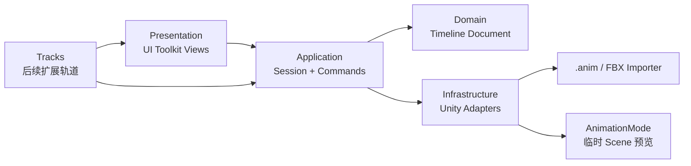

# Protocol_Evac Ability Composer 设计方案

## 一、文档目的与定位

`Ability Composer` 是项目内的通用动画能力编排工具。它不是 Player、Combat 或单一技能系统的附属 Inspector，而是一个独立的 Unity EditorWindow：先解决任意动画片段的 Scene 逐帧预览与 `Animation Event` 编辑，再按实际需求扩展时间窗口、特效、音效与能力数据轨道。

工具入口与代码位置：

```text
Assets/Scripts/Tools/Editor/AbilityComposer/
├─ 程序集：Tools.AbilityComposer.Editor
├─ 主窗口：AbilityComposerWindow
└─ 菜单：工具 / Ability / Ability Composer
```

命名含义：

```text
Ability
└─ 一项可被编排的能力或动作单元，不限定为战斗技能

Composer
└─ 在时间轴上组合动画、事件和后续扩展轨道
```

因此，`Walk`、`Run`、`Dodge`、攻击、交互动作以及未来的敌人和机关动画，都可以使用本工具。它不依赖 `Module.Player`、`Module.Combat` 或任何当前角色的业务数据。

## 二、已确认的产品决策

| 项目 | 决策 |
| --- | --- |
| 首版范围 | 通用动画预览与通用 `Animation Event` 编辑，不接入 Player、Combat、SkillConfig、Hitbox |
| 预览来源 | 支持场景 GameObject 与 Prefab，均以临时克隆预览 |
| 场景安全 | 不采样或修改原对象；临时预览根节点为 `__AbilityComposerPreview` |
| 动画输入 | 主输入为 `AnimationClip`；支持独立 `.anim`，FBX 需选择内部 Clip |
| 添加事件 | 仅提供一个通用的大号“＋ 添加事件”按钮，不预设左右脚或任何 Function |
| Function 编辑 | 右侧 Inspector 提供预览对象合法方法扫描与手动输入，并校验事件签名 |
| 保存方式 | 编辑先写入内存草稿；用户点击“应用到动画”时才写回资产 |
| 时间轴规则 | 逐帧吸附，帧号为主、秒数为辅，Clip FPS 自动读取 |
| 视觉风格 | Unity 深色工作区基础上使用蓝灰主色、琥珀播放头、青色选中态 |
| 文档边界 | 保留既有 Player 技能编辑器方案；本方案只定义通用 Ability Composer |

## 三、首版目标与非目标

### 1. 首版目标

```text
拖入动画
  -> 选择场景对象或 Prefab 作为预览来源
  -> 在 Scene View 中看见临时克隆对象的当前帧姿势
  -> 可播放、暂停、逐帧前后跳转、缩放和定位时间轴
  -> 在当前帧添加通用 Animation Event
  -> 编辑 Function 与 AnimationEvent 参数
  -> 拖动事件并吸附整数帧
  -> 显式应用到 .anim 或 FBX Importer
```

### 2. 明确不在首版实现

```text
不创建运行时 Ability 系统
不引入节点图、Graph 或 Flow
不读取或写入 PlayerSkillConfigSO
不实现 HitWindow、无敌帧、VFX、Audio 等业务轨道
不在拖动事件过程中反复重导 FBX
不修改原场景角色、FBX 骨骼、关键帧或 Clip 设置
```

## 四、窗口体验与视觉设计

窗口采用 UI Toolkit。整体布局是“上方工作上下文 + 左侧操作 + 中部时间轴 + 右侧详情”，而不是复刻 Unity Animation 窗口或任何外部工具的布局。

```text
┌─────────────────────────────────────────────────────────────────────────────┐
│ Ability Composer                                                             │
│ [预览对象 / Prefab] [AnimationClip] [FBX Clip 选择] [创建预览] [聚焦 Scene] │
├────────────────┬─────────────────────────────────────────┬──────────────────┤
│ 预览控制       │ 时间轴                                  │ Event Inspector  │
│ [|<][<][▶][>][>|]│ 帧标尺 F0  F5  F10  F15 ...            │ Frame            │
│ Frame 18 / 156 │ ──────────────────────────────────────  │ Function         │
│ FPS 30         │ Animation Events      ◇                 │ 参数类型与值      │
│                │                    播放头               │ Object Reference │
│ [＋ 添加事件]  │                                         │ [删除事件]       │
│ [删除选中]     │                                         │                  │
├────────────────┴─────────────────────────────────────────┴──────────────────┤
│ 逐帧吸附 │ 缩放 │ 当前帧输入 │ 草稿状态：未应用 │ [应用到动画] [还原草稿] │
└─────────────────────────────────────────────────────────────────────────────┘
```

### 1. 顶部工作上下文

顶部只负责确定本次编辑对象：

```text
预览对象 / Prefab
├─ 场景对象：克隆完整层级，适合带场景挂载武器的角色
└─ Prefab：实例化为隐藏且不保存的临时预览对象

AnimationClip
├─ 可直接指定 .anim 或 AnimationClip 子资产
└─ 拖入 FBX 时，显示其内部动画 Clip 供选择
```

### 2. 左侧预览控制

左侧包含明显且可点击面积足够的播放控制：跳首帧、上一帧、播放/暂停、下一帧和跳末帧。显示当前帧、总帧数、FPS 与当前时间。

“＋ 添加事件”是此区域的主按钮。点击后只在当前帧插入空事件，不隐含左右脚、命中或其他业务语义。

### 3. 中部时间轴

首版只存在一条 `Animation Events` 轨道：

```text
事件标记：菱形
未设置 Function：低饱和灰色
已设置 Function：蓝灰色
当前选中事件：青色描边
播放头：琥珀色竖线
```

时间轴以帧为主刻度。所有添加、拖动与帧输入均吸附到整数帧，右侧同时显示转换后的秒数。缩放改变可见刻度密度，不改变事件的真实帧位置。

### 4. 右侧 Event Inspector

只有选中事件时显示具体字段：

```text
Frame
Time
Function
Float Parameter
Int Parameter
String Parameter
Object Reference Parameter
Message Options
```

`Function` 优先从预览对象及其子层级可接收 Animation Event 的组件方法中列出；同时保留手动输入，以支持尚未挂载接收组件、延迟接入或跨对象约定的方法。工具应标记不符合 Unity Animation Event 调用规则的方法，但不擅自更改用户输入。

## 五、总体架构

采用“命令式分层架构 + 轨道扩展点”。它兼顾首版实现成本、数据安全与后续扩展，也能清楚说明 UI、编辑草稿和 Unity 资产写入之间的边界。



### 1. Presentation：只负责界面与输入

```text
AbilityComposerWindow
├─ 组合各个 View，管理窗口生命周期
├─ 不直接写入 AnimationClip 或 ModelImporter
└─ 不持有业务规则

TimelineView
├─ 绘制刻度、播放头、事件标记
├─ 将点击、拖拽和缩放转换为意图
└─ 不直接改变资产

EventInspectorView
├─ 显示选中事件字段
└─ 将字段修改转换为命令

PreviewToolbarView
└─ 发送播放、逐帧、创建预览和聚焦 Scene 意图
```

### 2. Application：编辑会话与命令流

`AbilityComposerSession` 保存一次打开窗口期间的工作上下文：预览来源、当前 Clip、当前帧、选中事件、内存草稿、脏状态与播放状态。

所有用户编辑均使用命令表达：

```text
AddAnimationEventCommand
MoveAnimationEventCommand
RemoveAnimationEventCommand
UpdateAnimationEventCommand
```

命令只修改内存中的 `TimelineDocument`，并保存操作前后的必要快照。这样拖动事件不会反复改写资产，也为草稿态撤销/重做提供基础。

撤销分为两层：

```text
应用前
└─ Ability Composer 命令栈撤销 / 重做内存草稿

应用后
└─ 使用 Unity Undo.RecordObject 记录 .anim 或 ModelImporter 的持久化变更
```

窗口需要监听 Unity Undo/Redo 回调。在已应用资产发生 Unity Undo/Redo 后，重新从资产读取事件并刷新草稿，避免显示旧数据。

### 3. Domain：可测试的纯编辑数据

`TimelineDocument` 是当前 Clip 的内存编辑快照，而不是新的运行时配置资产。它至少包含：

```text
Clip 标识
FPS
总帧数
AnimationEvent 列表
当前播放头帧
当前选中事件标识
是否存在未应用草稿
```

首版 Domain 不引用 `UnityEditor`，也不引用 Player 或 Combat 程序集。帧与秒的换算、事件排序、同帧事件稳定顺序、帧范围约束等规则在这一层完成并以 EditMode 测试覆盖。

### 4. Infrastructure：隔离 Unity 专用 API

该层负责将通用草稿与 Unity API 相互转换：

```text
AnimationEventReader
├─ 从 AnimationClip 读取 AnimationEvent
└─ 解析 FBX 内部 Clip 选择

AnimationEventWriter
├─ .anim：AnimationUtility.SetAnimationEvents
└─ FBX：ModelImporter.clipAnimations + SaveAndReimport

AnimationPreviewController
├─ 创建、采样和清理临时预览对象
├─ 独占 AnimationMode 生命周期
└─ 刷新和聚焦 SceneView

AnimationAssetResolver
└─ 解析 AnimationClip、FBX 路径、Importer 与内部 Clip 映射
```

UI 和 Application 不得直接调用 `AnimationUtility`、`ModelImporter`、`AssetDatabase`、`AnimationMode` 或 `SceneView`。

### 5. Tracks：后续扩展点

首版只有 `AnimationEventTrack`，无需提前实现完整插件框架。待至少出现三类真实轨道后，再抽取统一 `IAbilityTrack` 约定。

候选扩展轨道：

```text
AnimationEventTrack    首版
AbilityWindowTrack     命中、无敌、连段等时间窗口
VfxTrack               特效请求
AudioTrack             音效请求
CameraTrack            镜头请求
```

扩展轨道只向时间轴注册“绘制、命中测试、序列化草稿、生成命令”的能力；不得让某个业务轨道反向依赖通用 Animation Event 资产读写流程。

## 六、代码目录与命令模式

代码按“编辑职责”切片，而不是机械使用 `Core / Application / Infrastructure / Presentation` 顶层目录。这样可以从目录直接定位时间轴、事件、预览和 Unity 资产读写的维护位置，同时仍保留清晰的依赖方向。

```text
Assets/Scripts/Tools/Editor/AbilityComposer/
├─ Tools.AbilityComposer.Editor.asmdef
├─ AbilityComposerWindow.cs
├─ AbilityComposerContext.cs
│
├─ Timeline/
│  ├─ AbilityTimelineData.cs
│  ├─ AbilityTimelineView.cs
│  ├─ AbilityFrameResolver.cs
│  └─ Commands/
│     ├─ IAbilityTimelineCommand.cs
│     ├─ AbilityTimelineAddEventCommand.cs
│     ├─ AbilityTimelineMoveEventCommand.cs
│     ├─ AbilityTimelineRemoveEventCommand.cs
│     ├─ AbilityTimelineUpdateEventCommand.cs
│     └─ AbilityTimelineCommandBuffer.cs
│
├─ Event/
│  ├─ AbilityAnimationEventData.cs
│  ├─ AnimationEventReader.cs
│  ├─ AnimationEventWriter.cs
│  ├─ AnimationEventFunctionResolver.cs
│  └─ AbilityEventInspectorView.cs
│
├─ Preview/
│  ├─ AbilityPreviewController.cs
│  └─ AbilityPreviewData.cs
│
├─ Animation/
│  ├─ AnimationClipResolver.cs
│  └─ AnimationClipData.cs
│
└─ UI/
   ├─ AbilityComposerToolbarView.cs
   ├─ Uxml/AbilityComposerWindow.uxml
   └─ Uss/AbilityComposerWindow.uss

Assets/Tests/Editor/Tools/AbilityComposer/
├─ AbilityTimelineDataTests.cs
└─ AbilityTimelineCommandBufferTests.cs
```

### 1. 命令模式的职责

命令模式限定在 `Timeline/Commands/`。每一个草稿编辑操作都实现 `IAbilityTimelineCommand`，并明确提供执行与撤销行为：

```text
IAbilityTimelineCommand
├─ Execute(AbilityTimelineData)
└─ Undo(AbilityTimelineData)

AbilityTimelineCommandBuffer
├─ Execute(command)
├─ Undo()
└─ Redo()
```

首版命令覆盖添加事件、移动事件、删除事件和更新事件字段。`AbilityComposerController` 是唯一允许创建并提交这些命令的协调者；`AbilityTimelineView` 和 `AbilityEventInspectorView` 只发送用户意图，不能直接修改 `AbilityTimelineData`。

```text
Timeline View 拖拽事件
  -> AbilityComposerController 创建 MoveEventCommand
  -> AbilityTimelineCommandBuffer.Execute
  -> AbilityTimelineData 发生内存变化
  -> Preview Controller 重新采样
  -> UI 局部刷新
```

### 2. 草稿命令与资产持久化分离

`IAbilityTimelineCommand` 只作用于内存草稿，因此拖拽中不会触发资源导入或磁盘写入。用户点击“应用到动画”后，才由 `AnimationEventWriter` 把当前 `AbilityTimelineData` 写入 `.anim` 或目标 FBX Importer。

```text
未应用草稿
└─ AbilityTimelineCommandBuffer 负责 Undo / Redo

已应用资产
└─ AnimationEventWriter 使用 Unity Undo.RecordObject 后写入资产
```

这是两套不同生命周期的撤销机制：前者保证时间轴交互顺滑，后者保证 Unity Project 资产可被原生 Undo/Redo 恢复。二者不能合并为一个命令栈。

### 3. 依赖规则

```text
UI View
  -> AbilityComposerController
  -> Timeline Command / Timeline Data
  -> AnimationEventReader / Writer、AbilityPreviewController
  -> UnityEditor API
```

禁止的依赖：

```text
UI View -> AssetDatabase / ModelImporter / AnimationMode
Timeline Command -> AnimationEventWriter
AnimationEventWriter -> UI View
Preview Controller -> Player / Combat 运行时模块
```

## 七、Scene 预览生命周期

场景预览必须使用真实层级的临时克隆，尤其是当前玩家武器由场景层级挂在手部节点的情况。不得单独实例化模型 FBX 后据此判断持武器效果。

```text
用户指定预览对象或 Prefab
  -> AnimationPreviewController 创建 __AbilityComposerPreview 根节点
  -> 实例化完整克隆，设置 HideFlags.DontSave
  -> AnimationMode.StartAnimationMode
  -> AnimationMode.SampleAnimationClip(临时克隆, 当前 Clip, 当前时间)
  -> SceneView.RepaintAll

当前帧改变
  -> 重新 SampleAnimationClip
  -> Scene View 立即显示对应姿势

关闭窗口 / 切换来源 / 发生异常
  -> 销毁临时根节点
  -> AnimationMode.StopAnimationMode
  -> SceneView.RepaintAll
```

首版预览只负责姿势与动画事件的视觉定位，不模拟运行时 Animator 状态机、物理、输入或战斗命中。若 Clip 的根运动表现需要更高保真度，后续以独立预览模式扩展，不在首版混入运行时逻辑。

## 八、Animation Event 资产读写规则

### 1. 草稿先行

```text
添加 / 删除 / 拖拽 / 修改参数
  -> 只修改 TimelineDocument
  -> 标记为“未应用”
  -> 立即刷新 Scene 预览和时间轴

点击“应用到动画”
  -> 校验草稿
  -> 记录 Unity Undo
  -> 写入资产
  -> 重新读取资产作为新基线
```

### 2. `.anim` 与 FBX 的差异

```text
独立 .anim
└─ 通过 AnimationUtility 写入 AnimationEvent，并标记资产 Dirty

导入 FBX
└─ 通过 ModelImporter 的目标 Clip 配置写入 events，再 SaveAndReimport
```

FBX 可能包含多个内部 Clip。Writer 必须按照 Clip 名称与 Importer 配置精确匹配，不允许写入“第一个 Clip”作为兜底。找不到对应配置时应在窗口中展示明确错误，不写入任何数据。

### 3. 数据安全边界

```text
允许修改
└─ Animation Event 的时刻、Function、参数与 Message Options

首版禁止修改
├─ FBX 骨骼
├─ 动画关键帧
├─ Clip 名称
├─ Clip 时长
├─ Loop 与 Root Motion 导入设置
└─ Animator Controller
```

## 九、实现阶段与验收

| 阶段 | 交付 | 验收 |
| --- | --- | --- |
| P0 | 空窗口、UI Toolkit 布局、程序集与菜单入口 | 打开/关闭无 Console Error，窗口不依赖 Player/Combat |
| P1 | 预览来源选择、临时克隆、AnimationMode 逐帧采样 | 场景对象和 Prefab 都能预览；关闭后无临时对象、无场景脏数据 |
| P2 | Clip 读取、帧标尺、播放头、播放与逐帧控制 | Clip FPS、总帧数、帧/秒换算正确，Scene 姿势实时同步 |
| P3 | Animation Event 草稿、添加、删除、拖拽、Inspector | 添加事件默认无 Function；拖拽严格吸附整数帧；草稿未应用前资产不变 |
| P4 | `.anim` / FBX 显式应用、Undo/Redo、错误提示 | 两类资源可持久化；FBX 多 Clip 不串写；Undo/Redo 后界面与资产一致 |
| P5 | 通用轨道扩展评估 | 出现至少三种真实轨道后再抽象 IAbilityTrack |

## 十、测试策略

### 1. EditMode 单元测试

不依赖 Unity 场景的 Domain 规则应覆盖：

```text
帧与秒的双向换算
帧范围约束
同帧事件排序稳定性
添加、移动、删除命令的执行与撤销
草稿 Dirty 状态切换
```

### 2. Unity 编辑器集成验证

```text
独立 .anim 添加、移动、删除并重新打开验证
单 Clip FBX 写入后检查 Importer events
多 Clip FBX 只修改目标 Clip
场景对象预览保留场景挂载武器
Prefab 预览不在 Hierarchy 留下对象
关闭窗口、切换 Clip、脚本重编译后 AnimationMode 正常退出
```

## 十一、风险与处理原则

| 风险 | 处理原则 |
| --- | --- |
| 拖动事件导致频繁 FBX 重导 | 草稿先行，只有“应用到动画”写入 |
| 预览对象与原对象重叠或污染场景 | 使用 `__AbilityComposerPreview` 临时根节点、`HideFlags.DontSave`、统一清理 |
| FBX 多 Clip 写错目标 | 依据明确 Clip 映射写入；映射失败时拒绝保存并显示错误 |
| Event Function 在运行时不存在 | 编辑期提示签名/接收组件问题，但保留手动输入能力 |
| 为未来轨道过早泛化 | 首版只实现 AnimationEventTrack，真实出现第三类轨道后才抽接口 |

## 十二、与现有文档的关系

[技能系统与编辑器设计方案.md](../玩家状态与敌人AI/技能系统与编辑器设计方案.md) 继续定义 Player Skill 数据、`PlayerSkillConfigSO`、`PlayerSkillStepData` 与 Player 专用能力编辑路线。

本方案定义独立、通用的 Ability Composer。未来若 Player Skill 需要时间窗口可视化，应由 Player 编辑扩展或 Combat 扩展接入 Ability Composer 的轨道能力；不得让通用工具直接依赖 Player 运行时模块。
