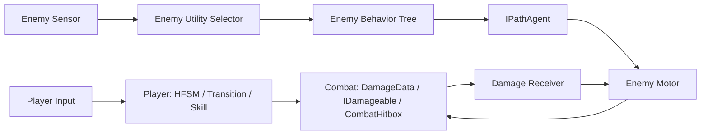

# Protocol_Evac 战斗系统总开发文档

## 一、文档定位

本文是战斗相关开发的总入口，覆盖：

```text
Combat 基础协议
Player 输入、HFSM、状态转换与 Skill
命中、受伤、硬直与死亡的后续闭环
Enemy 感知、Utility AI、Behavior Tree 与寻路
```

它不替代已有细化设计：

- `../玩家状态与敌人AI/玩家状态与敌人AI设计方案.md`：Player 与 Enemy 的总体架构方案
- `../玩家状态与敌人AI/技能系统与编辑器设计方案.md`：Skill 数据、时间轴和编辑器路线
- `../AI归档记录/`：按日期记录实际变更、验证结果和短期交接

冲突时按以下优先级处理：

```text
当前已验证的代码、Prefab、Scene 与配置
> 最新 AI 归档中的明确结论
> 本总开发文档
> 早期设计方案与历史归档
```

本文记录的是长期开发契约。每完成一个可验证的竖切，再在 AI 归档中记录具体文件、资源路径和验证结果。

## 二、当前结论

现有文档足以支撑当前 Player 的继续开发，但不足以直接支撑完整战斗系统和 Enemy AI 的连续实现。

原因不是缺少架构方向，而是缺少三类开发契约：

```text
1. 已实现事实与未来方案的明确分层
2. Combat、Player、Enemy 之间可执行的接口与依赖顺序
3. Enemy BT、Utility、感知、寻路的最小行为闭环和验收标准
```

本文补充这些内容。它不提前实现 Enemy，也不把尚未确认的设计伪装成已落地功能。

## 三、当前实现基线

### 1. 已实现或已装配

| 系统 | 当前事实 | 状态 |
| --- | --- | --- |
| Player Input | `PlayerInputReader`、`PlayerInputBuffer`、Sprint Interpreter 已存在 | 已装配 |
| Player HFSM | Grounded / Airborne / Action / Skill / Disabled 的状态 Id 和状态树工厂已存在 | 已装配 |
| Player Transition | 声明式 Rule、Controller、Selector 已存在 | 已装配 |
| Player Skill | 通用 `PlayerSkillConfigSO`、`PlayerSkillStepData`、Timeline、普攻状态已存在 | 已装配 |
| Player 表现 | Animator 写入、Root Motion 接收、武器挂右手及按状态显隐已存在 | 已装配 |
| Combat 基础 | `DamageData`、`IDamageable`、`CombatHitbox`、`CombatTargetDummy` 已存在 | 已实现，未完成竖切 |
| Enemy / 通用 AI | 当前没有 `Module/Enemy` 或 `Module/AI` 实现文件 | 未开始 |

### 2. 当前 Player 调度事实

`PlayerController` 当前 `Update()` 顺序是运行时事实：

```text
PlayerInputReader
-> PlayerViewController
-> PlayerTransitionSelector
-> PlayerStateMachine
-> PlayerSkillController
-> PlayerWeaponController
-> PlayerAnimWriter
```

`FixedUpdate()`：

```text
PlayerStateMachine.FixedTick
-> PlayerMotor.FixedTick
```

已有设计文档中存在“Skill 先于 Transition / HFSM”的推荐顺序。它是待验证的架构建议，不应在没有明确行为问题和 Play Mode 回归验证时，仅为对齐文档而调整现有调度。

### 3. 当前直接缺口

```text
PlayerSkillStepData.HitWindow 尚未调用 CombatHitbox.Open / Close
三段普攻的 HitWindow、Damage 尚未配置
CombatHitbox 尚未挂到武器或其他攻击节点
CombatTargetDummy 尚未形成场景内单段命中验证
Enemy 感知、意图、BT、PathAgent、生命与攻击均未实现
```

## 四、长期模块边界



### 1. Combat 是共享底座

`Combat` 只保存跨角色通用的命中和受伤协议：

```text
Combat
├─ DamageData：一次命中的基础事实
├─ IDamageable：接收伤害的最小接口
└─ CombatHitbox：范围检测、Layer 过滤、同窗口去重、提交伤害
```

依赖方向必须保持：

```text
Combat <- Player
Combat <- Enemy
Combat 不引用 Player、Enemy 或具体 Skill
```

第一版不创建全局 `CombatSystem`。只有出现击杀统计、掉落、战斗 UI、音效等多个跨模块消费者时，才增加外层事件或系统。

### 2. Player 是首个 Combat 消费者

职责固定为：

```text
PlayerNormalAttackState
└─ 负责普攻状态生命周期与连段输入

PlayerSkillTimeline
└─ 负责当前段、时钟、推进窗口、结束

PlayerSkillController
└─ 根据当前段 HitWindow 驱动 CombatHitbox

CombatHitbox
└─ 在窗口内只对同一 IDamageable 提交一次 DamageData
```

`PlayerController` 只负责获取场景引用、装配依赖和调度，不逐帧编写攻击判定。

### 3. Enemy 是第二个 Combat 消费者

Enemy 不直接依赖 Player 的 HFSM、Skill 或状态类型。Enemy 攻击在需要时同样提供：

```text
攻击伤害值
伤害来源 GameObject
攻击窗口开关
```

并使用 `CombatHitbox` 与 `IDamageable` 完成最小命中。Enemy 的攻击动画、冷却和行为阶段属于 Enemy 自己的行为层。

### 4. Context 的数据所有权

| Context | 写入者 | 读取者 | 禁止职责 |
| --- | --- | --- | --- |
| `PlayerContext` 输入事实 | InputReader / InputBuffer | Transition、State、Skill | 直接播放动画、直接移动 |
| `PlayerContext` 行为意图 | State / Skill / Transition | Motor / Animation Writer | 跨角色数据仓库 |
| `EnemyContext` 感知事实 | EnemySensor | Utility / BT | 做复杂评分、直接寻路 |
| `EnemyContext` 当前意图 | Utility Selector | BT / Animator / Debug | 直接执行攻击或移动 |
| `EnemyContext` 行为结果 | BT Node / PathAgent | Brain / Debug | 替代感知原始数据 |

Context 只保存同一角色跨子系统共享的运行时事实。私有计时、节点内部暂态和缓存留在所属模块中。

## 五、近期第一优先级：Player 命中竖切

先完成最小闭环，不同时扩展完整三连、Enemy、硬直或编辑器。

### 目标

```text
玩家第一段普攻
-> 武器上的 CombatHitbox 在配置时间窗打开
-> 命中一个 CombatTargetDummy
-> 同一窗口只扣一次血
-> 攻击结束、取消或状态退出后 Hitbox 关闭
```

### 实现边界

1. 在 `Hero_Chaisaki` 的武器层级中创建独立 `WeaponHitbox` 节点，并挂载 `CombatHitbox`
2. 由 `PlayerController` 在装配阶段取得该引用并传入 Skill 模块
3. `PlayerSkillController` 根据 `PlayerSkillStepData.TryGetHitWindow(...)` 管理开关
4. `PlayerSkillTimeline` 仍只维护段落和时间，不直接依赖 Unity 命中组件
5. 在 Timeline 段落切换、技能结束、Skill Close、对象禁用时关闭 Hitbox
6. 第一轮仅配置第一段普攻的窗口和伤害

### 验收

```text
第一段窗口外不造成伤害
第一段窗口内命中目标一次
同一个目标多个 Collider 不重复受伤
连续物理帧不重复受伤
普攻退出、闪避取消或对象禁用后不遗留攻击判定
Console 没有命中盒配置、空引用或程序集错误
```

## 六、Player 后续开发顺序

| 阶段 | 内容 | 前置 | 验收 |
| --- | --- | --- | --- |
| P0 | 第一段普攻命中竖切 | 当前武器与 Skill 配置 | 一目标一窗口一次伤害 |
| P1 | 三段普攻分别配置窗口、伤害、Root Motion | P0 稳定 | 每段时机正确，连段不丢输入 |
| P2 | Player 受伤、硬直、死亡 | P0，Player 可接收 DamageData | 受伤中断与死亡锁定符合优先级 |
| P3 | Dodge 无敌帧、受击/闪避交互 | P2 | 命中、无敌、打断行为可复现 |
| P4 | Special Skill / Ultimate | P1 | 各自有独立时间轴与取消规则 |
| P5 | Skill 编辑器与命中盒预览 | P1 与数据结构稳定 | 编辑、Undo、预览不改变运行时契约 |

`DisabledHurt` 和 `DisabledDead` 虽已出现在 Player 状态 Id 中，不能因此视为受击死亡系统已经完成。

## 七、Enemy 第一版设计契约

Enemy 代码开始前，先把第一版范围锁定为一个近战敌人：

```text
Patrol
-> 发现 Player
-> Chase
-> 进入攻击距离后 Attack
-> 丢失目标后前往 LastSeenPosition
-> Search
-> 回到 Patrol
```

第一版不包括组队协同、掩体、远程弹道、逃跑、召唤、复杂仇恨或多目标择优。

### 1. Enemy 模块职责

```text
EnemyBrain
├─ 创建 EnemyContext
├─ 装配 Sensor、Utility、BT、PathAgent、Motor、Animator
├─ 按配置频率调度
└─ 处理启用、禁用、死亡

EnemySensor
├─ 搜索与筛选目标
├─ 计算距离、视野、攻击范围
└─ 写入 CurrentTarget、CanSeeTarget、LastSeenPosition

EnemyUtilitySelector
├─ 读取感知和属性事实
├─ 计算 Patrol / Chase / Attack / Search 候选
└─ 写入 CurrentIntent

EnemyBehaviorTreeRunner
├─ 按 CurrentIntent 选择行为分支
├─ 执行节点 Tick 与 Running 生命周期
└─ 写入行为结果，不重新计算 Utility

IPathAgent
├─ 接收目标点
├─ 请求、取消、更新路径
└─ 输出可供 EnemyMotor 消费的移动结果
```

### 2. Enemy 的更新节奏

不让所有层每帧重复做昂贵计算。第一版应将刷新间隔配置在 `EnemyBehaviorConfigSO` 中：

```text
每帧：EnemyMotor、当前 BT Running 节点、Animator 表现
固定间隔：EnemySensor、Utility Selector、Path 重算
仅在条件变化：攻击窗口开关、目标丢失、死亡、路径取消
```

具体数值不是本文固定设计数据，开始 Enemy 竖切时按实际敌人数与测试场景确定。

### 3. Utility AI 契约

第一版候选限定为：

```text
Patrol / Chase / Attack / Search
```

选择器必须具备：

```text
显式评分输入
稳定的同分决策规则
当前意图最短保持时间或切换阈值
当前意图与各候选分数的 Debug 输出
```

Utility 只写 `CurrentIntent`，不直接移动、播动画或调用攻击命中。

### 4. Behavior Tree 契约

通用 BT 至少包含：

```text
BtNode
BtStatus: Success / Failure / Running
Selector
Sequence
Condition
Action
```

每个节点必须明确：

```text
Tick 的输入与输出
Running 时保留的节点私有状态
Success / Failure 的结束条件
目标、意图、死亡变化时的 Reset 或 Abort 行为
```

节点不直接查询全局对象，不在节点中自行构造 `EnemyContext`，也不绕过 `IPathAgent` 调用具体寻路实现。

### 5. 感知和目标选择前置决策

创建 EnemySensor 前必须确认以下内容，并写入 Enemy 配置：

```text
可攻击阵营与 LayerMask
目标选择规则：最近、仇恨最高或固定 Player
视野遮挡检测方式与 Obstacle LayerMask
攻击距离的计算基准
目标丢失判定与 LastSeenPosition 保留时长
```

这些不是实现细节；它们直接决定 Sensor、Utility 和 BT 的输入语义。

### 6. 寻路前置决策

当前项目未配置单独的 AI Navigation / A* 路径包。Enemy 开始移动前必须先确认路径方案：

```text
Unity NavMesh / AI Navigation
第三方 A* 插件
自研 Grid A*
```

无论选哪种，Enemy 只依赖 `IPathAgent`。不要让 BT 节点、Sensor 或 Utility 直接依赖具体路径插件。

## 八、Enemy 开发顺序与验收

| 阶段 | 交付 | 验收 |
| --- | --- | --- |
| E0 | Enemy 程序集、Prefab、`EnemyContext`、`EnemyBrain` | 生成、启用、禁用、销毁没有悬挂回调 |
| E1 | `EnemySensor` 与 Debug Gizmos | 能稳定写入目标、可见性、距离、最后看见位置 |
| E2 | `EnemyIntent` 与 Utility Selector | Patrol / Chase / Attack / Search 切换不抖动 |
| E3 | BT 基础节点与 Runner | Running、Reset、Abort 行为可观察且可复现 |
| E4 | `IPathAgent` 与 EnemyMotor | Chase、Search、Patrol 不直接依赖路径实现 |
| E5 | Enemy 近战攻击接入 Combat | Enemy 对 Player 的单窗口伤害可验证 |
| E6 | Enemy 受伤、硬直、死亡 | Player 命中 Enemy 后行为正确终止或切换 |

开始 E0 前，P0 必须完成。开始 E5 前，Player 与 Enemy 的受伤承接协议必须已确认，不能只用 `CombatTargetDummy` 代替正式目标行为。

## 九、数据与配置边界

### 1. 已存在的 Player 配置

```text
PlayerSettingsSO
├─ InputConfig
├─ MoveConfig
├─ AirConfig
├─ DodgeConfig
├─ NormalAttackConfig
└─ ViewConfig

PlayerSkillStepData
├─ AnimationClip
├─ Duration
├─ UseRootMotion
├─ ShowWeapon
├─ StepAdvanceWindow
├─ HitWindow
└─ Damage
```

### 2. Enemy 第一版待建立的配置

```text
EnemyConfigSO
├─ MaxHealth
├─ MoveSpeed / TurnSpeed
├─ AttackRange / AttackCooldown
├─ Target / Obstacle LayerMask
├─ SightRange / SightAngle
└─ PatrolPoints

EnemyBehaviorConfigSO
├─ Sensor / Utility / Path 刷新间隔
├─ Intent 切换阈值与最短保持时间
├─ Patrol / Chase / Attack / Search 参数
└─ BT 模板或行为参数
```

不要在创建 Enemy 时复制 Player 的配置结构。两者共享的是 Combat 协议，不是输入、状态或行为配置。

## 十、测试、调试与文档维护

### 1. 竖切测试优先

每一个功能只扩展一个最小闭环：

```text
P0：一段普攻 -> 一个 Dummy -> 一次伤害
E1：一个 Enemy -> 一个 Player 目标 -> 感知数据正确
E2：一个 Enemy -> 四个 Intent -> 无抖动切换
E3：一个 Enemy -> 一棵小 BT -> Running / Reset 正确
E5：一个 Enemy 攻击窗口 -> Player 受伤一次
```

### 2. 调试要求

| 系统 | 必须可观察的数据 |
| --- | --- |
| Player | 当前状态、当前技能段、HitWindow、移动/技能锁定、武器显隐 |
| Combat | Hitbox 开关、命中目标、伤害值、窗口内去重结果 |
| Enemy Sensor | 当前目标、可见性、距离、LastSeenPosition |
| Enemy Utility | 当前 Intent、所有候选分数、切换原因 |
| Enemy BT | 当前 Running 节点、节点状态、Reset / Abort 原因 |
| PathAgent | 是否有路径、目标点、路径状态、最后刷新时间 |

高频日志仅在开发调试阶段使用，并遵守项目的 `QLog` 与 `UNITY_EDITOR` 规范。

### 3. 文档更新规则

完成功能竖切时：

```text
1. 更新本文件中的状态矩阵与当前直接缺口
2. 在 AI 归档新增对应交接记录
3. 若架构边界改变，同步更新 Player / Enemy 主设计文档
4. 不把尚未验证的计划写成“已完成”
```

## 十一、后续能力建设与战斗系统落地方向

以下三项是后续需要系统学习并落地的技术方向。它们应服务于可验证的战斗体验和战斗系统规模，而不是脱离战斗场景单独堆叠展示功能。

### 1. ECS：从战斗中的高数量实体问题开始

后续跟随 B 站 C 酱的课程学习 ECS。初期目标是理解数据布局、系统调度、生命周期和性能测量，再以战斗中实际出现的高数量实体为切入点，例如批量投射物、范围持续伤害、密集敌人感知或群体 Buff。

当前 Player HFSM、Combat 竖切和 Enemy 第一版仍维持现有面向对象模块边界。没有明确的数量级压力、性能数据和可独立替换的竖切前，不把已验证的 Player / Combat 整体重写为 ECS。

### 2. 手写 Shader：以战斗反馈为验收目标

后续手写 Shader 脚本，优先服务战斗信息表达和操作反馈，例如：

```text
受击闪白 / 受击染色
溶解、死亡与生成反馈
武器拖影与攻击残影
技能范围指示与地面预警
护盾、蓄力、锁定和命中反馈
```

每个 Shader 都应挂接到具体的 Combat、Player Skill 或 Enemy 行为竖切，并定义可观察的触发时机与资源释放边界；不先制作只用于展示、没有战斗事件来源的效果。

### 3. A* 寻路：作为 Enemy 行为的可替换执行层

后续学习并实现 A* 寻路，主要落在 Enemy 的 Chase、Search、Patrol 行为上。实现前仍需在 Unity NavMesh、第三方 A* 和自研 Grid A* 之间完成最终技术取舍，并明确地图类型、动态障碍、路径更新频率与性能目标。

无论具体方案如何，Enemy 的 Utility、BT 和 Sensor 只依赖 `IPathAgent`。A* 实现只能作为 `IPathAgent` 的一种后端，不能让行为节点直接耦合具体寻路算法。

### 4. 与当前优先级的关系

上述方向属于战斗系统长期能力建设，能够在 Enemy、Skill 和 Combat 竖切中形成可展示的技术成果，但不改变当前 P0 的交付顺序。先完成并验证第一段普攻的命中闭环，再根据真实缺口选择下一项专题竖切。

## 十二、禁止提前实现的内容

在对应竖切前，不实现以下内容：

```text
全局 CombatSystem
完整伤害类型、元素反应、抗性或 Buff 框架
多形状、动态切换的通用 Hitbox 框架
多目标复杂仇恨、组队协作、掩体与逃跑
完整 Enemy BT 编辑器
将 Player HFSM 抽成尚未验证的通用状态机框架
让 BT、Skill 或 State 直接依赖 QF 全局服务
```

它们都应由真实的跨系统需求推动，而不是先行搭建。

## 十三、下一步

当前唯一应执行的功能任务是 P0：将第一段普攻的 `HitWindow` 接到武器上的 `CombatHitbox`，并完成单目标、单窗口、一次伤害的 Play Mode 验证。

P0 通过后，再开始三段普攻的数据配置；Enemy 开发从 E0 开始，而不是直接创建复杂行为树。
