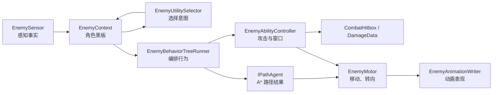

# Protocol_Evac 敌人 AI、能力与导航设计方案

## 一、文档目的与当前结论

本文定义第一版近战 Enemy 的长期架构边界，以及后续接入 A* 与 ECS 群体避障时不推翻现有模块的演进路径。

结论如下：

```text
Enemy：BT 编排行为 + Utility 决策意图 + A* 导航
Ability：复用现有 Ability Window、Combat 与 Ability Composer 的制作能力
Player：保留 Input Buffer + HFSM + Skill，不迁移到 Enemy BT
Editor：行为树编辑器做成通用的可视化工具，但不取代 Ability Composer
```

Enemy 的“想做什么”与“如何执行”必须分离：Utility 负责选择意图，BT 负责执行流程，Ability / PathAgent 负责实际攻击或导航，Motor 负责最终移动、旋转与表现。

## 二、范围与非目标

### 1. 第一版范围

第一版只交付一个近战敌人的完整行为闭环：

```text
Patrol
-> 发现 Player
-> Chase
-> 进入攻击距离后 Attack
-> 失去目标后前往 LastSeenPosition
-> Search
-> 回到 Patrol
```

必须包含感知、意图切换、BT Running/Abort、路径请求、近战攻击窗口、受击和死亡的清理边界。

### 2. 当前不做

```text
多目标仇恨、组队协同、远程弹道、掩体、逃跑、召唤
完整通用技能框架重写
完整群体避障或 ECS 化
完整行为树编辑器的所有装饰器、子树、热重载和运行时调试
让 Player 的输入、HFSM 或 State 直接由 Enemy BT 驱动
```

## 三、当前可复用资产与边界

### 1. 立即复用

| 现有能力 | Enemy 中的用途 | 边界 |
| --- | --- | --- |
| `AbilityWindowTrackBaseSO` 与命中/无敌窗口轨道 | 敌人攻击、蓄力、无敌和可取消窗口 | 轨道只描述时间窗口，不负责决策或移动 |
| `CombatHitbox`、`DamageData`、`IDamageable` | 敌人对 Player 造成伤害；Player 对 Enemy 造成伤害 | Combat 不依赖 Enemy 或 Player |
| Ability Composer 的动画预览、时间轴、Animation Event、窗口编辑与保存流程 | 为 Enemy Ability 编辑攻击窗口与动画事件 | Composer 是“能力时间轴工具”，不是行为树工具 |
| Player Root Motion / Motor 的经验 | Enemy Motor 的位移、转向、动画驱动边界 | 不复制 Player 的 Input / HFSM 实现 |

### 2. 暂不直接复用

| Player 模块 | 原因 |
| --- | --- |
| `PlayerInputReader` / `PlayerInputBuffer` | Enemy 没有玩家输入，应该由 Sensor 和 Intent 写入行为事实 |
| `PlayerStateMachine` / Transition Rules | Player 的跳跃、闪避、输入取消规则与 Enemy 决策模型不同 |
| `PlayerSkillTimeline` / `PlayerSkillStepData` | 当前含 Player 专属连段、输入缓存和动画阶段语义；Enemy 只能先复用能力窗口与 Combat 协议 |

当第二种以上角色都需要“多段 Ability 时间轴”时，再从 Player 专属 Timeline 中抽出不含输入/连段的 `CombatAbilityTimeline`。在此之前不为了通用而提前重写已验证的 Player Skill。

## 四、总体运行架构



### 1. EnemyBrain

`EnemyBrain` 是装配与调度入口，不承载具体行为规则。它负责创建 `EnemyContext`，绑定 Sensor、Utility、BT、Ability、PathAgent、Motor、Animation 与受伤/死亡事件，并按配置频率调度它们。

### 2. EnemyContext

EnemyContext 是单个敌人的运行时黑板，不是全局对象。建议按以下类别保存事实：

```text
引用：Transform、CombatHitbox、目标、配置、PathAgent
感知：CurrentTarget、CanSeeTarget、DistanceToTarget、LastSeenPosition、LastSeenTime
意图：CurrentIntent、IntentEnteredTime、各候选 Utility Score
导航：Destination、HasPath、PathStatus、RemainingDistance、PreferredVelocity
动作：CurrentAbility、AbilityPhase、Cooldown、IsMovementLocked
生命：Health、IsHurt、IsDead
调试：当前 BT Running 节点、最近 Abort 原因、最后一次路径刷新时间
```

Context 只保存可被多个模块消费的事实。BT 节点的临时计时器、Path 的内部缓存和 Ability 的阶段时钟保留在各自模块中。

## 五、感知、Utility 与 BT 的分工

### 1. EnemySensor：写入事实

Sensor 以固定间隔更新，不在每帧重复做昂贵的视线和目标搜索：

```text
查找目标 -> 距离判断 -> 视野角判断 -> 遮挡检测
-> 写入 CurrentTarget / CanSeeTarget / LastSeenPosition
```

第一版的目标选择固定为 Player；接口仍以 `ITargetable` / 阵营与 LayerMask 的语义设计，避免日后重写感知层。

### 2. EnemyUtilitySelector：选择意图

第一版候选只有 `Patrol`、`Chase`、`Attack`、`Search`。每个候选把明确输入映射成分数，例如距离、是否可见、是否可攻击、丢失目标时间、攻击冷却。

必须具备：

```text
同分时固定优先级
最短意图保持时间
切换阈值（新意图必须明显更高才切换）
当前意图和全部分数的可视化调试
```

Utility 只写 `CurrentIntent`；不得直接播放动画、移动或开关 Hitbox。

### 3. EnemyBehaviorTreeRunner：执行流程

BT 读取 `CurrentIntent` 并运行对应分支。第一版通用节点最少包含：

```text
BtNode / BtStatus（Success、Failure、Running）
Selector / Sequence
Condition / Action
```

Enemy 专属叶节点包括：`MoveToTarget`、`MoveToLastSeenPosition`、`PlayAbility`、`Wait`、`AdvancePatrolPoint`。意图、目标、死亡或路径失败变化时，Runner 必须显式 Abort / Reset 当前 Running 分支，并关闭遗留攻击窗口和导航请求。

## 六、Enemy Ability：复用时间轴，而非复用 Player Skill

### 1. 运行时职责

Enemy 的攻击由 `EnemyAbilityController` 执行。BT 中的 `PlayAbility` 只请求一个 Ability 并等待其完成；Controller 负责动画、冷却、窗口推进和 Combat 输出。

```text
BT PlayAbility
-> EnemyAbilityController.Start(AbilityId)
-> 播放攻击动画 / 锁移动
-> 按 Ability Window 开关 CombatHitbox、无敌、转向等效果
-> Ability 完成或被 Abort
-> 清理窗口并将结果返回 BT
```

### 2. 第一版 EnemyAbilityConfigSO

每个 Ability 配置至少包含：

```text
AnimationClip / AnimationStateId
Duration
Cooldown
CanRotate / IsMovementLocked
DamageData
AbilityWindowTrackBaseSO[]
```

第一版只需近战攻击与受击/死亡的必要动作。`DamageData`、Hitbox 与窗口含义与 Player 一致；Enemy 不需要 Player 的连段推进、输入缓存和技能请求优先级。

### 3. Ability Composer 的定位

Ability Composer 继续是“单个动作时间轴”的唯一编辑入口：预览动画、编辑窗口、添加 Animation Event、保存轨道。Enemy 攻击配置接入它，不新建第二套敌人时间轴编辑器。

## 七、通用行为树编辑器设计

### 1. 定位

行为树编辑器暂定为 `Behavior Graph`：它只负责可视化编辑和调试“决策/流程图”，不编辑攻击窗口、不替代 Ability Composer。

| 工具 | 编辑对象 | 典型内容 |
| --- | --- | --- |
| Ability Composer | 单条动画的时间轴 | 命中窗口、无敌窗口、动画事件、持续时间 |
| Behavior Graph | 角色的决策与流程 | Selector、Sequence、Condition、Move、PlayAbility |

### 2. 通用数据与运行时隔离

编辑资产建议是 `BehaviorGraphSO`，保存节点记录、连线、节点参数和黑板键引用。运行时必须从资产创建每个敌人独立的 Node Runtime；不得把 Running 状态、计时器、当前子节点索引写回 ScriptableObject，否则多个敌人会共享状态。

第一版节点分三层：

```text
通用组合节点：Selector / Sequence
通用条件节点：Blackboard Bool、距离比较、冷却完成
领域动作节点：MoveTo、PlayAbility、Wait、Patrol
```

### 3. Player 是否使用

编辑器可以通用，但 Player 运行时不迁移到 BT。Player 仍由 Input Buffer、HFSM、Skill 和 Transition 处理直接操作手感。

后续 Player 可以有限使用 Behavior Graph，例如剧情脚本、演示模式、自动测试、AI 队友或高层任务流程；这些用途只能调用 Player 的公开行为请求，不能绕过 HFSM/Skill 直接驱动 Motor 或 Animator。

### 4. 编辑器落地顺序

```text
B0：先完成代码构造的最小 BT 与运行时调试
B1：BehaviorGraphSO、基础节点和保存/加载
B2：GraphView 可视化编辑 Selector / Sequence / 条件 / 动作
B3：PlayMode 节点高亮、Context 黑板和 Abort 原因面板
B4：出现真实复用需求后再加入子树、Decorator、模板
```

## 八、A* 导航、局部避障与 ECS 演进

### 1. 接口优先

BT 与 Utility 只依赖 `IPathAgent`，接口语义为：设置目的地、取消请求、刷新路径、读取路径状态、读取下一拐点与期望速度。具体 A*、NavMesh 或未来实现都只能是后端适配器。

```text
BT MoveTo
-> IPathAgent.SetDestination
-> PathAgent 产出路径拐点 / PreferredVelocity
-> EnemyMotor 执行最终移动
```

### 2. 第一阶段：单体 A*

先实现或接入 A* 路径搜索，Enemy 以路径拐点追击、搜索和巡逻。路径只在目的地明显变化、路径失效或固定低频刷新时重算；每帧只由 Motor 沿当前拐点移动。

### 3. 第二阶段：局部避障

A* 解决“到哪里走”，不解决多个敌人近距离互相挤压。局部避障是独立层：

```text
PathAgent 输出 PreferredVelocity
-> LocalAvoidance 根据邻居计算 AdjustedVelocity
-> EnemyMotor 消费 AdjustedVelocity
```

第一批少量敌人可用 OOP 的邻居查询验证行为；不要把避障逻辑塞进 BT 节点或 A* 搜索本体。

### 4. 第三阶段：ECS 群体避障

当有明确数量级压力与 Profiler 数据后，将高频、同构的邻居收集和速度修正迁到 ECS：

```text
OOP EnemyBrain / BT / Ability
-> 写入 Destination、PreferredVelocity、Radius、Priority
-> ECS CrowdAvoidanceSystem 批量生成 AdjustedVelocity
-> EnemyMotor 或桥接层读取结果执行
```

这使 Enemy 的决策、Ability 和 Combat 继续保留可读的 OOP 边界，而 ECS 只承担大量实体的热点计算。PathAgent 同样可先是 OOP A*，只有路径请求规模成为瓶颈时再做批处理或 ECS 化。

## 九、分阶段交付与验收

| 阶段 | 交付 | 可验证结果 |
| --- | --- | --- |
| E0 | EnemyContext、Brain、生命与 Prefab 装配 | 启用/禁用/死亡无悬挂状态 |
| E1 | Sensor 与 Gizmos | 目标、可见性、距离、LastSeenPosition 正确 |
| E2 | Utility Intent | 四种意图切换稳定且可观察 |
| E3 | 最小 BT | Running、Success、Failure、Abort 可复现 |
| E4 | IPathAgent + EnemyMotor | Patrol / Chase / Search 不耦合具体导航实现 |
| E5 | EnemyAbility + Combat | 攻击窗口内只对 Player 提交一次伤害 |
| E6 | Hurt / Dead | 受击中断正确，死亡清理 BT、路径和 Hitbox |
| E7 | Behavior Graph 编辑器 | 可编辑最小树，PlayMode 可查看节点执行 |
| E8 | 局部避障与 ECS 评估 | 依据敌人数和 Profiler 决定是否迁移热点 |

## 十、开始实现前需要确认的设计数据

```text
Enemy 可攻击的阵营 / LayerMask
视野距离、视野角、遮挡 LayerMask
攻击距离、攻击前摇/后摇、冷却、转向规则
丢失目标后 LastSeenPosition 的保留时间与 Search 行为
巡逻点来源与回退规则
A* 地图表达、动态障碍、寻路刷新频率
首批性能目标：同时活动敌人数与避障密度
```

这些数据确认后，实施顺序固定为 E0 -> E1 -> E2 -> E3 -> E4 -> E5。不得先搭完整编辑器或 ECS，再回头补单个 Enemy 的行为闭环。
