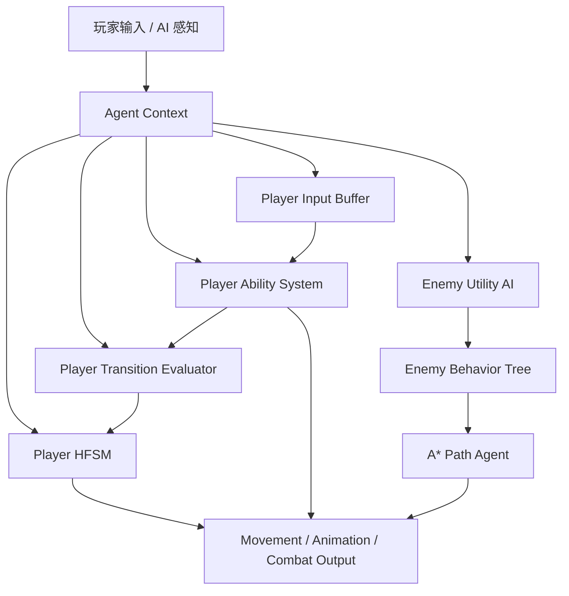

# 玩家状态与敌人 AI 设计方案

## 1. 设计结论

本方案只保留两条核心路线：

- Player：Input Buffer + HFSM + Ability System + Transition Evaluator
- Enemy：BT + Utility AI + A*
- 共享思想：每个角色拥有自己的 Context 上下文结构，用来保存运行时记忆、组件引用、输入、感知结果、目标、冷却与状态标记

参考文章只用于理解“行为树/AI 通过上下文或黑板共享运行时数据”的思路，本方案不提取文章内容，而是按 `Protocol_Evac` 的玩家与敌人需求重新组织。

## 2. 总体目标

### 2.1 Player 目标

玩家侧重点是“响应稳定、状态清晰、能力可扩展”：

- 用 Input Buffer 管理预输入、连招输入和输入容错
- 用 HFSM 管理玩家宏观状态，例如 Grounded、Airborne、Action、Disabled
- 用 Ability System 管理普攻、闪避、技能、受击等能力的冷却、阶段、打断和效果窗口
- 用 Transition Evaluator 统一处理状态切换、取消、打断和优先级
- 用 `PlayerContext` 保存输入、组件、属性、移动意图、Ability 意图、当前状态等共享数据
- 状态机只负责“玩家现在处于什么行为状态”
- Ability System 只负责“玩家正在执行什么能力，以及能力生命周期如何推进”

### 2.2 Enemy 目标

敌人侧重点是“决策可组合、行为可调权重、寻路可替换”：

- 用 Behavior Tree 表达行为流程，例如巡逻、追击、攻击、搜索、撤退
- 用 Utility AI 给可选目标打分，例如攻击、追击、靠近掩体、呼叫支援、逃离
- 用 A* 负责路径搜索与移动目标点规划
- 用 `EnemyContext` 作为敌人的黑板，保存感知目标、仇恨、距离、血量比例、当前意图、路径状态等信息
- BT 不直接计算复杂优先级，复杂优先级交给 Utility AI
- Utility AI 不直接驱动动画与移动，它只选择意图或目标
- A* 不关心敌人策略，只负责“从当前位置到目标位置怎么走”

## 3. 核心架构



核心原则：

- Context 是“当前角色的运行时记忆”
- 状态机、Ability、行为树、效用决策都通过 Context 协作
- Controller/Brain 负责调度，不负责塞满具体行为逻辑
- 数据配置优先使用 ScriptableObject
- 运行时状态优先放在 Context，不散落到各个节点和状态里

## 4. 推荐文件结构

建议放在现有 `Assets/Scripts/Module` 下，保持玩家、敌人、通用 AI 分区清晰。

```text
Assets/Scripts/Module/
├─ Player/
│  ├─ Core/
│  │  ├─ PlayerController.cs
│  │  ├─ PlayerMotor.cs
│  │  └─ PlayerAnimatorDriver.cs
│  ├─ Context/
│  │  └─ PlayerContext.cs
│  ├─ Input/
│  │  ├─ PlayerInputReader.cs
│  │  ├─ PlayerInputBuffer.cs
│  │  ├─ PlayerInputSnapshot.cs
│  │  └─ PlayerBufferedInputType.cs
│  ├─ FSM/
│  │  ├─ PlayerStateId.cs
│  │  ├─ PlayerStateBase.cs
│  │  ├─ PlayerStateMachine.cs
│  │  ├─ PlayerCompositeState.cs
│  │  └─ States/
│  │     ├─ Grounded/
│  │     │  ├─ PlayerGroundedState.cs
│  │     │  ├─ PlayerIdleState.cs
│  │     │  ├─ PlayerMoveState.cs
│  │     │  └─ PlayerSprintState.cs
│  │     ├─ Airborne/
│  │     │  ├─ PlayerAirborneState.cs
│  │     │  ├─ PlayerJumpState.cs
│  │     │  └─ PlayerFallState.cs
│  │     ├─ Action/
│  │     │  ├─ PlayerActionState.cs
│  │     │  ├─ PlayerAttackState.cs
│  │     │  ├─ PlayerSkillState.cs
│  │     │  └─ PlayerDodgeState.cs
│  │     └─ Disabled/
│  │        ├─ PlayerDisabledState.cs
│  │        ├─ PlayerHurtState.cs
│  │        └─ PlayerDeadState.cs
│  ├─ Transition/
│  │  ├─ PlayerTransitionEvaluator.cs
│  │  ├─ PlayerTransitionRequest.cs
│  │  ├─ PlayerTransitionRule.cs
│  │  └─ PlayerInterruptPriority.cs
│  └─ Ability/
│     ├─ PlayerAbilityController.cs
│     ├─ PlayerAbilitySlot.cs
│     ├─ PlayerAbilityRequest.cs
│     ├─ PlayerAbilityRuntime.cs
│     ├─ AbilityDefinitionSO.cs
│     ├─ AbilityPhase.cs
│     └─ Abilities/
│        ├─ NormalAttackAbility.cs
│        ├─ DodgeAbility.cs
│        ├─ SkillAbility.cs
│        └─ HurtAbility.cs
├─ Enemy/
│  ├─ Core/
│  │  ├─ EnemyBrain.cs
│  │  ├─ EnemyMotor.cs
│  │  ├─ EnemySensor.cs
│  │  └─ EnemyAnimatorDriver.cs
│  ├─ Context/
│  │  └─ EnemyContext.cs
│  ├─ BT/
│  │  ├─ EnemyBehaviorTreeRunner.cs
│  │  ├─ EnemyBehaviorTreeFactory.cs
│  │  └─ Nodes/
│  │     ├─ CheckTargetVisibleNode.cs
│  │     ├─ MoveToTargetNode.cs
│  │     ├─ AttackTargetNode.cs
│  │     ├─ PatrolNode.cs
│  │     ├─ SearchLastSeenPositionNode.cs
│  │     └─ WaitNode.cs
│  ├─ Utility/
│  │  ├─ EnemyUtilitySelector.cs
│  │  ├─ EnemyUtilityOption.cs
│  │  ├─ EnemyUtilityScore.cs
│  │  └─ Options/
│  │     ├─ AttackUtilityOption.cs
│  │     ├─ ChaseUtilityOption.cs
│  │     ├─ PatrolUtilityOption.cs
│  │     ├─ SearchUtilityOption.cs
│  │     └─ FleeUtilityOption.cs
│  └─ Pathfinding/
│     ├─ IPathAgent.cs
│     ├─ AStarPathAgent.cs
│     └─ PathRequest.cs
└─ AI/
   ├─ BT/
   │  ├─ BtNode.cs
   │  ├─ BtStatus.cs
   │  ├─ BtSelector.cs
   │  ├─ BtSequence.cs
   │  ├─ BtParallel.cs
   │  ├─ BtConditionNode.cs
   │  └─ BtActionNode.cs
   └─ Utility/
      ├─ UtilityCurveSO.cs
      └─ UtilityMath.cs
```

说明：

- `Module/AI` 放通用 BT/Utility 基础设施
- `Module/Enemy/BT/Nodes` 放敌人专属行为节点
- `Module/Enemy/Utility/Options` 放敌人专属打分项
- `Module/Enemy/Pathfinding` 只暴露寻路接口和适配器，避免 BT 节点直接依赖具体 A* 插件
- `Module/Player/Input` 负责输入读取和预输入缓存，不直接切状态
- `Module/Player/Transition` 负责状态切换、取消、打断和优先级判断
- `Module/Player/Ability` 负责普攻、闪避、技能、受击等能力生命周期
- 如果后续玩家 Ability 也要被敌人复用，可以把 `Ability` 抽到 `Module/Combat/Ability`

## 5. Context 上下文设计

### 5.1 Context 的职责

Context 保存“同一个角色在运行时需要共享的数据”：

- 必要组件引用
- 当前输入或 AI 意图
- 当前目标
- 当前生命值、体力、资源
- 地面检测、受击、硬直、无敌等状态标记
- 冷却、计时器、最近一次事件
- 感知结果，例如可见目标、最后看见位置、听觉来源
- 寻路状态，例如是否有路径、目标点、剩余距离

Context 不做这些事：

- 不直接播放动画
- 不直接移动角色
- 不直接做复杂行为判断
- 不直接生成技能效果
- 不直接访问全局单例完成核心逻辑

可以把 Context 理解成“这个角色的专属运行时黑板”，但不要把它做成全局黑板。

### 5.2 Context 的生命周期

推荐由 Controller/Brain 创建或持有：

- `Awake`：缓存组件，初始化 Context 的引用字段
- `OnEnable`：重置运行时状态，订阅必要事件
- `Update`：写入输入、感知、Utility/BT/HFSM 结果
- `FixedUpdate`：根据 Context 的运动意图执行物理移动
- `OnDisable`：取消事件，清理临时状态

### 5.3 PlayerContext 建议字段

```csharp
public sealed class PlayerContext
{
    public Transform SelfTransform { get; set; }
    public PlayerMotor Motor { get; set; }
    public PlayerAnimatorDriver AnimatorDriver { get; set; }

    public PlayerInputBuffer InputBuffer { get; set; }
    public Vector2 MoveInput { get; set; }
    public Vector2 LookInput { get; set; }
    public bool IsSprintPressed { get; set; }
    public PlayerAbilityRequest AbilityRequest { get; set; }
    public PlayerTransitionRequest TransitionRequest { get; set; }

    public bool IsGrounded { get; set; }
    public bool IsMovementLocked { get; set; }
    public bool IsAbilityLocked { get; set; }
    public bool IsInputLocked { get; set; }
    public bool IsInvincible { get; set; }
    public bool IsInAction { get; set; }
    public bool IsInDisabledState { get; set; }
    public bool IsDead { get; set; }

    public float CurrentHealth { get; set; }
    public float CurrentStamina { get; set; }
    public float MoveSpeed { get; set; }
    public Vector3 MoveDirection { get; set; }
    public Vector3 Velocity { get; set; }

    public PlayerStateId CurrentStateId { get; set; }
    public PlayerStateId PreviousStateId { get; set; }
    public PlayerAbilityRuntime ActiveAbility { get; set; }
    public PlayerInterruptPriority CurrentInterruptPriority { get; set; }
}
```

实际落地时可以继续拆细：

- 输入相关可拆成 `PlayerInputContext`
- 属性相关可拆成 `PlayerStatsContext`
- 能力相关可拆成 `PlayerAbilityContext`
- 状态切换相关可拆成 `PlayerTransitionContext`

前期建议先保持一个 `PlayerContext`，等字段明显膨胀后再拆。

### 5.4 EnemyContext 建议字段

```csharp
public sealed class EnemyContext
{
    public Transform SelfTransform { get; set; }
    public EnemyMotor Motor { get; set; }
    public EnemySensor Sensor { get; set; }
    public IPathAgent PathAgent { get; set; }
    public EnemyAnimatorDriver AnimatorDriver { get; set; }

    public Transform CurrentTarget { get; set; }
    public Vector3 LastSeenTargetPosition { get; set; }
    public Vector3 InvestigatePosition { get; set; }
    public Vector3 PatrolPoint { get; set; }

    public bool HasTarget { get; set; }
    public bool CanSeeTarget { get; set; }
    public bool IsTargetInAttackRange { get; set; }
    public bool IsPathReady { get; set; }
    public bool IsDead { get; set; }

    public float CurrentHealth { get; set; }
    public float HealthRatio { get; set; }
    public float TargetDistance { get; set; }
    public float AlertValue { get; set; }
    public float AttackCooldownTimer { get; set; }

    public EnemyIntent CurrentIntent { get; set; }
    public EnemyIntent PreviousIntent { get; set; }
    public BtStatus LastBtStatus { get; set; }
}
```

敌人 Context 的关键是“感知、意图、行为结果”三类数据要分清：

- 感知数据由 `EnemySensor` 写入
- 意图数据由 `EnemyUtilitySelector` 写入
- 行为结果由 BT 节点和 `IPathAgent` 写入

## 6. Player：Input Buffer + HFSM + Ability + Transition Evaluator

### 6.1 Player 分层结论

玩家不只是一套 HFSM，而是四层协作：

```text
Player
├─ Input Buffer：预输入、连招输入、短时间容错
├─ HFSM：移动、空中、动作、禁用等宏观状态
├─ Ability System：普攻、技能、闪避、受击等能力生命周期
└─ Transition Evaluator：状态切换、取消、打断、优先级规则
```

这四层的关系：

- `Input Buffer` 只记录输入，不直接释放技能，不直接切状态
- `HFSM` 只回答“玩家当前处于哪类行为状态”
- `Ability System` 只推进能力生命周期，例如前摇、生效、后摇、冷却
- `Transition Evaluator` 统一决定能不能从当前状态切到目标状态
- `PlayerContext` 是四层之间共享的运行时上下文

### 6.2 Player 调度顺序

建议每帧流程：

```text
PlayerController.Update
├─ PlayerInputReader.Tick()
│  └─ 读取当前帧输入
├─ PlayerInputBuffer.Tick()
│  └─ 缓存 Jump / Attack / Skill / Dodge 等输入
├─ 更新地面、速度、生命、锁定标记等 Context 数据
├─ PlayerAbilityController.Tick()
│  └─ 消耗输入缓存，生成 AbilityRequest 或推进 ActiveAbility
├─ PlayerTransitionEvaluator.Tick()
│  └─ 根据 Context / AbilityRequest / 当前状态生成 TransitionRequest
├─ PlayerStateMachine.Tick()
│  └─ 执行 TransitionRequest，更新当前状态
└─ PlayerAnimatorDriver.Tick()
   └─ 读取 Context 更新动画参数

PlayerController.FixedUpdate
└─ PlayerMotor.FixedTick()
   └─ 根据 Context 执行移动、跳跃、闪避位移等物理结果
```

调度原则：

- 输入先进入 Buffer，避免玩家按早一点就丢输入
- Ability 先于 HFSM Tick，因为能力可能申请进入 `Action` 或 `Disabled`
- Transition Evaluator 统一判断切换合法性，避免每个状态里散落打断规则
- HFSM 只执行已确认的切换，不自己到处抢决策权
- Motor 最后执行实际移动，保证状态、能力、锁定都已经写入 Context

### 6.3 HFSM 推荐层级

玩家 HFSM 建议按“宏观状态组 + 叶子状态”组织：

```text
Player HFSM
├─ Grounded
│  ├─ Idle
│  ├─ Move
│  └─ Sprint
├─ Airborne
│  ├─ Jump
│  └─ Fall
├─ Action
│  ├─ Attack
│  ├─ Skill
│  └─ Dodge
└─ Disabled
   ├─ Hurt
   └─ Dead
```

推荐第一版就按这个层级写，但实现可以从轻量版开始：

- `PlayerCompositeState` 表示 `Grounded`、`Airborne`、`Action`、`Disabled`
- 叶子状态负责具体行为，例如 `PlayerMoveState`
- 如果第一版时间紧，可以先只实现一层状态机，但 `PlayerStateId` 要保留层级命名

状态 Id 示例：

```csharp
public enum PlayerStateId
{
    GroundedIdle,
    GroundedMove,
    GroundedSprint,
    AirborneJump,
    AirborneFall,
    ActionAttack,
    ActionSkill,
    ActionDodge,
    DisabledHurt,
    DisabledDead
}
```

### 6.4 HFSM 各层职责

| 状态层 | 职责 | 典型进入条件 | 典型退出条件 |
| --- | --- | --- | --- |
| Grounded | 地面移动、待机、疾跑 | 落地、动作结束回地面 | 起跳、下落、攻击、闪避、受击、死亡 |
| Airborne | 起跳、滞空、下落 | Jump 输入、离地 | 落地、受击、死亡 |
| Action | 攻击、技能、闪避等主动动作 | AbilityRequest 通过校验 | Ability 结束、被高优先级打断 |
| Disabled | 受击、眩晕、死亡等强制状态 | 受到伤害、死亡、硬控 | 受击恢复、复活、死亡不退出 |

叶子状态职责：

| 叶子状态 | 职责 |
| --- | --- |
| Idle | 无移动输入时待机，监听移动、跳跃、攻击、闪避等输入缓存 |
| Move | 普通地面移动，写入移动方向和目标速度 |
| Sprint | 疾跑移动，处理体力消耗或疾跑限制 |
| Jump | 起跳瞬间，设置向上速度，随后转 Fall |
| Fall | 下落和落地检测，落地后转 Grounded |
| Attack | 承载普攻 Ability 的动作表现、转向锁定、连招窗口 |
| Skill | 承载主动技能 Ability 的释放表现和锁定规则 |
| Dodge | 承载闪避 Ability 的无敌帧、位移方向、动作锁定 |
| Hurt | 承载受击 Ability 的硬直、击退、短暂无输入 |
| Dead | 禁用输入、移动、Ability 与常规切换 |

### 6.5 Input Buffer

`Input Buffer` 用来解决两个问题：

- 预输入：玩家在落地前、后摇快结束前提前按键，也能在合法窗口触发
- 连招：普攻期间提前输入下一段攻击，在连招窗口打开时消费

建议缓存的输入类型：

```csharp
public enum PlayerBufferedInputType
{
    Jump,
    Attack,
    Skill,
    Dodge,
    Interact
}
```

缓存数据建议包含：

```text
BufferedInput
├─ InputType
├─ PressTime
├─ ExpireTime
├─ Direction
├─ SkillSlotIndex
└─ IsConsumed
```

基础规则：

- Jump、Dodge 可以有短缓存，例如 0.12 到 0.2 秒
- Attack 可以支持更长一点的连招缓存，例如 0.2 到 0.35 秒
- Skill 是否缓存取决于技能类型，瞬发技能可以缓存，瞄准类技能不建议缓存太久
- 被 `Disabled` 状态控制时，普通输入可以保留或清空，由受击规则决定

### 6.6 Transition Evaluator

`Transition Evaluator` 是玩家侧最容易被忽略但很关键的一层，专门处理：

- 当前状态能不能切目标状态
- 当前 Ability 能不能被取消
- 新 Ability 能不能打断旧 Ability
- 受击、死亡这类强制切换是否覆盖一切
- 输入缓存什么时候被消费

建议优先级：

```text
Dead
└─ Hurt / Stun
   └─ Dodge
      └─ Skill
         └─ Attack
            └─ Jump
               └─ Move / Sprint / Idle
```

也可以转成数值：

```csharp
public enum PlayerInterruptPriority
{
    None = 0,
    Movement = 10,
    Jump = 20,
    Attack = 30,
    Skill = 40,
    Dodge = 50,
    Hurt = 80,
    Dead = 100
}
```

切换请求建议结构：

```text
PlayerTransitionRequest
├─ TargetStateId
├─ SourceAbility
├─ Priority
├─ CanConsumeBufferedInput
├─ ShouldCancelCurrentAbility
└─ Reason
```

推荐规则：

- `Dead` 永远可以打断其他状态
- `Hurt` 可以打断普通移动、攻击和大部分技能，但不能打断死亡
- `Dodge` 是否能取消攻击，由 Ability 配置决定
- `Attack` 连段不直接切状态，而是让当前 AttackAbility 消费下一段输入
- `Skill` 能不能被 Dodge 取消，由 `AbilityDefinitionSO` 的取消窗口决定
- `Grounded` 与 `Airborne` 的自然切换由地面检测驱动

### 6.7 Ability System

这里建议用 `Ability` 这个概念，而不是只叫 `Skill`。因为玩家的普攻、闪避、受击也有生命周期、打断规则、锁定规则和动画窗口，它们本质上也是能力。

```text
Ability System
├─ NormalAttackAbility：普攻、连段、命中帧
├─ DodgeAbility：闪避、无敌帧、位移
├─ SkillAbility：主动技能、消耗、冷却、效果
└─ HurtAbility：受击、硬直、击退、受击保护
```

Ability 分层：

- 配置层：`AbilityDefinitionSO`
- 运行时层：`PlayerAbilityRuntime`
- 调度层：`PlayerAbilityController`

```text
AbilityDefinitionSO
├─ AbilityId
├─ AbilityType
├─ Cooldown
├─ Cost
├─ CastTime
├─ ActiveTime
├─ RecoveryTime
├─ InputBufferTime
├─ InterruptPriority
├─ CanBeCancelled
├─ CancelWindow
├─ LockMovement
├─ LockRotation
├─ InvincibleWindow
└─ EffectParams
```

Ability 生命周期：

```text
Ready
└─ Cast
   └─ Active
      └─ Recovery
         └─ Cooldown
            └─ Ready
```

建议枚举：

```csharp
public enum AbilityPhase
{
    Ready,
    Cast,
    Active,
    Recovery,
    Cooldown
}
```

### 6.8 HFSM 与 Ability 的边界

| 问题 | 归属 |
| --- | --- |
| 玩家当前是不是在地面 | HFSM / Context |
| 玩家能不能移动 | HFSM 读取 Context 锁定规则 |
| 普攻第几段 | Ability Runtime |
| 普攻是否能接下一段 | Ability Runtime + Input Buffer |
| 闪避冷却和无敌帧 | DodgeAbility |
| 闪避期间的宏观状态 | HFSM 的 ActionDodge |
| 技能能否释放 | PlayerAbilityController |
| 技能能否被取消 | Transition Evaluator + AbilityDefinitionSO |
| 受击硬直和击退 | HurtAbility + DisabledHurt |
| 死亡 | DisabledDead，最高优先级 |

核心规则：

- HFSM 管“姿态和控制权”
- Ability 管“能力生命周期和效果窗口”
- Input Buffer 管“输入时机容错”
- Transition Evaluator 管“谁能切谁、谁能打断谁”
- Context 管“共享运行时事实”

### 6.9 Player 最小可运行版本

第一版建议先实现：

```text
Input Buffer
├─ Jump
├─ Attack
└─ Dodge

HFSM
├─ GroundedIdle
├─ GroundedMove
├─ AirborneJump
├─ AirborneFall
├─ ActionAttack
├─ ActionDodge
├─ DisabledHurt
└─ DisabledDead

Ability
├─ NormalAttackAbility
├─ DodgeAbility
└─ HurtAbility

Transition Evaluator
├─ Dead 强制最高优先级
├─ Hurt 打断移动和攻击
├─ Dodge 可取消移动
└─ Attack 可从 Grounded 进入
```

等这套跑通后，再加入 `Sprint`、更多主动 `SkillAbility`、连招分支和复杂取消窗口。

## 7. Enemy：BT + Utility AI + A*

### 7.1 Enemy 调度顺序

建议每帧流程：

```text
EnemyBrain.Update
├─ EnemySensor.Tick()
├─ EnemyUtilitySelector.Tick()
├─ EnemyBehaviorTreeRunner.Tick()
└─ EnemyAnimatorDriver.Tick()

EnemyBrain.FixedUpdate
└─ EnemyMotor.FixedTick()
```

建议频率：

- Sensor：每 0.1 到 0.2 秒更新一次
- Utility AI：每 0.2 到 0.5 秒更新一次
- BT：每帧或每 0.1 秒 Tick
- A* 路径刷新：目标变化明显或间隔达到阈值再刷新

这样可以避免所有敌人每帧都做完整感知、评分和寻路。

### 7.2 Utility AI 职责

Utility AI 只负责选择“当前最值得做的意图”。

建议第一版意图：

```csharp
public enum EnemyIntent
{
    None,
    Patrol,
    Investigate,
    Chase,
    Attack,
    Flee
}
```

评分输入：

- 目标是否存在
- 是否看见目标
- 与目标距离
- 自身生命比例
- 攻击冷却是否结束
- 警戒值
- 上一次意图

评分输出：

- `EnemyContext.CurrentIntent`
- `EnemyContext.PreviousIntent`
- 可选：`EnemyContext.InvestigatePosition`

防抖规则：

- 当前意图分数没有明显低于新意图时，不切换
- 给当前意图一点惯性分
- 攻击、逃离这类强意图可以有更高优先级

### 7.3 Utility 评分示例

| Intent | 高分条件 | 低分条件 |
| --- | --- | --- |
| Attack | 目标可见、距离在攻击范围、冷却完成 | 目标不可见、冷却未完成 |
| Chase | 目标可见、距离较远但可追击 | 无目标、距离过远 |
| Investigate | 目标刚丢失、有最后位置 | 从未发现目标 |
| Patrol | 无目标、低警戒 | 高警戒、有目标 |
| Flee | 血量很低、目标很近 | 血量健康、目标很远 |

### 7.4 BT 职责

BT 负责把意图变成行为流程。

推荐根节点结构：

```text
Root Selector
├─ Sequence: Dead
│  ├─ CheckDead
│  └─ PlayDead
├─ Sequence: Attack
│  ├─ CheckIntentAttack
│  ├─ CheckTargetVisible
│  ├─ FaceTarget
│  └─ AttackTarget
├─ Sequence: Chase
│  ├─ CheckIntentChase
│  ├─ MoveToTarget
│  └─ UpdateLastSeenPosition
├─ Sequence: Investigate
│  ├─ CheckIntentInvestigate
│  ├─ MoveToLastSeenPosition
│  └─ SearchArea
├─ Sequence: Flee
│  ├─ CheckIntentFlee
│  ├─ FindSafePosition
│  └─ MoveToSafePosition
└─ Sequence: Patrol
   ├─ CheckIntentPatrol
   └─ Patrol
```

BT 节点规范：

- 条件节点只判断，不修改核心状态
- 行为节点可以修改 Context 中的行为结果
- 节点不直接 `FindObjectOfType`
- 节点不直接持有场景单例
- 节点通过 `EnemyContext` 获取目标、路径、传感器和 Motor

### 7.5 BT 节点返回值

```csharp
public enum BtStatus
{
    Success,
    Failure,
    Running
}
```

约定：

- `Success`：当前节点完成
- `Failure`：当前节点条件不满足或执行失败
- `Running`：当前节点还在执行，例如正在移动到目标点

### 7.6 A* 寻路封装

不建议让 BT 节点直接依赖具体 A* 实现。先定义接口：

```csharp
public interface IPathAgent
{
    bool HasPath { get; }
    bool IsPathPending { get; }
    float RemainingDistance { get; }
    Vector3 DesiredVelocity { get; }

    void SetDestination(Vector3 position);
    void Stop();
    void Tick(float deltaTime);
}
```

然后实现适配器：

- `AStarPathAgent`：适配 A* Pathfinding Project 或自研 A*
- `EnemyMotor`：根据 `IPathAgent.DesiredVelocity` 移动角色
- `MoveToTargetNode`：只调用 `SetDestination`，不关心路径细节

如果后续改用 Unity NavMesh 或别的寻路方案，只替换 `IPathAgent` 实现即可。

### 7.7 Enemy 行为数据流

```text
EnemySensor
└─ 写入 CanSeeTarget / CurrentTarget / TargetDistance / LastSeenTargetPosition

EnemyUtilitySelector
└─ 读取感知与属性，写入 CurrentIntent

EnemyBehaviorTreeRunner
└─ 根据 CurrentIntent 执行对应行为节点

IPathAgent
└─ 接收目标点，计算路径与期望速度

EnemyMotor
└─ 执行移动与转向
```

## 8. Controller 与 Brain 的职责边界

### 8.1 PlayerController

只做调度和生命周期管理：

- 创建 `PlayerContext`
- 缓存组件
- 初始化 HFSM
- 初始化 InputBuffer、AbilityController、TransitionEvaluator
- 每帧更新输入、Ability、状态、动画
- 每个物理帧调用 Motor

不要在 `PlayerController` 里写大量移动、Ability、动画细节。

### 8.2 EnemyBrain

只做调度和生命周期管理：

- 创建 `EnemyContext`
- 缓存组件
- 初始化 Sensor、Utility、BT、PathAgent
- 按频率 Tick 各系统
- 统一处理死亡、启用、禁用

不要在 `EnemyBrain` 里硬编码复杂行为分支。

## 9. 与 QF 框架的关系

结论：本方案不建议用 QF 来实现 Player Input Buffer、HFSM、Ability 生命周期、Transition Evaluator、Enemy BT、Utility AI 或 A* 核心逻辑，但可以参考并使用 QF 做外层工程组织。

原因：

- Player 状态机和 Enemy 行为树属于高频运行逻辑，需要轻量、直接、可调试
- Ability、BT 节点、Utility 评分项更适合做成纯 C# 类，方便单独测试和复用
- Context 是每个角色自己的运行时记忆，不适合注册成全局 QF Model
- QF 的 Architecture、System、Model、Command、Query 更适合处理跨模块协作，不适合塞进每个敌人的每帧决策

### 9.1 推荐使用 QF 的地方

可以用 QF 承担这些“外层系统”：

- `GameModel`：保存全局游戏进度、玩家长期属性、关卡状态
- `PlayerModel`：保存可持久化的玩家数据，例如已解锁技能、背包、成长数值
- `EnemySpawnSystem`：管理敌人生成、回收、波次
- `CombatEventSystem`：分发伤害、击杀、受击、警报等跨模块事件
- `AbilityConfigSystem`：加载和查询 Ability 配置
- `AudioSystem` / `UISystem`：响应战斗事件播放音效或刷新 UI
- `Command`：表达一次明确的跨系统动作，例如 `ApplyDamageCommand`、`UnlockSkillCommand`
- `Query`：读取跨模块数据，例如 `GetPlayerLevelQuery`、`GetSkillConfigQuery`

### 9.2 不推荐使用 QF 的地方

这些部分建议保持独立，不直接继承或依赖 QF：

- `PlayerStateBase`
- `PlayerStateMachine`
- `PlayerInputBuffer`
- `PlayerAbilityRuntime`
- `PlayerTransitionEvaluator`
- `EnemyContext`
- `EnemyUtilityOption`
- `BtNode`
- `MoveToTargetNode`
- `IPathAgent`

这些类可以通过 Context、构造函数或初始化方法拿到必要依赖。需要通知外部系统时，再由 Controller/Brain 统一转发到 QF，而不是让每个状态、Ability、BT 节点直接 `SendCommand`。

### 9.3 推荐边界

```text
Unity MonoBehaviour 层
├─ PlayerController / EnemyBrain
│  ├─ 持有 Context
│  ├─ 调度 HFSM / Skill / BT / Utility / PathAgent
│  └─ 必要时对接 QF Command / Event / Query
│
纯逻辑层
├─ PlayerInputBuffer
├─ PlayerStateMachine
├─ PlayerAbilityController
├─ PlayerTransitionEvaluator
├─ EnemyBehaviorTreeRunner
├─ EnemyUtilitySelector
└─ IPathAgent
   └─ 不直接依赖 QF
│
QF 架构层
├─ Model：长期数据
├─ System：跨模块服务
├─ Command：跨模块动作
└─ Query：跨模块查询
```

### 9.4 Context 与 QF Model 的区别

| 类型 | 生命周期 | 数据性质 | 示例 |
| --- | --- | --- | --- |
| Context | 跟随单个角色实例 | 高频运行时数据 | 当前目标、当前状态、移动方向、Ability 锁定 |
| QF Model | 跟随架构或游戏流程 | 长期或全局数据 | 玩家等级、已解锁 Ability、关卡进度 |
| QF System | 跟随架构或场景模块 | 跨模块服务 | 敌人生成、音频播放、配置查询 |

原则：

- `PlayerContext` / `EnemyContext` 不注册为 QF Model
- `PlayerController` / `EnemyBrain` 可以作为 QF 与纯逻辑层之间的适配入口
- 状态、Ability、BT 节点内部不要直接依赖 QF，避免后期测试和复用困难

### 9.5 推荐接入方式

当玩家 Ability 造成伤害时：

```text
AbilityRuntime
└─ 生成伤害请求，写入 Context 或回调给 PlayerAbilityController

PlayerController
└─ 统一发送 ApplyDamageCommand

CombatSystem
└─ 计算伤害、派发受击事件、通知 UI/音效
```

当敌人死亡时：

```text
EnemyBrain
└─ 检测 EnemyContext.IsDead

EnemyBrain
└─ 发送 EnemyDeadCommand 或触发 CombatEventSystem

EnemySpawnSystem / UISystem / AudioSystem
└─ 响应击杀统计、掉落、音效、任务进度
```

这样既能利用 QF 的跨模块能力，又不会让 AI 和状态机逻辑被框架绑死。

## 10. 数据配置建议

### 10.1 Player 配置

```text
PlayerConfigSO
├─ 最大生命值
├─ 最大体力
├─ 移动速度
├─ 疾跑速度
├─ 跳跃力度
├─ 重力参数
├─ 闪避距离
├─ 闪避时间
└─ 默认 Ability 列表
```

```text
AbilityDefinitionSO
├─ AbilityId
├─ AbilityName
├─ AbilityType
├─ Cooldown
├─ CastTime
├─ ActiveTime
├─ RecoveryTime
├─ StaminaCost
├─ InputBufferTime
├─ InterruptPriority
├─ LockMovement
├─ LockRotation
├─ CanBeInterrupted
└─ EffectParams
```

### 10.2 Enemy 配置

```text
EnemyConfigSO
├─ 最大生命值
├─ 移动速度
├─ 转向速度
├─ 视野距离
├─ 视野角度
├─ 听觉半径
├─ 攻击距离
├─ 攻击冷却
├─ 追击最大距离
├─ 巡逻点配置
└─ Utility 权重配置
```

```text
EnemyBehaviorConfigSO
├─ BT 模板类型
├─ Utility 权重
├─ 感知刷新间隔
├─ 决策刷新间隔
├─ 寻路刷新间隔
└─ 行为参数
```

## 11. 命名空间建议

按项目和模块划分：

```csharp
ProtocolEvac.Player
ProtocolEvac.Player.Input
ProtocolEvac.Player.FSM
ProtocolEvac.Player.Transition
ProtocolEvac.Player.Ability
ProtocolEvac.Enemy
ProtocolEvac.Enemy.BT
ProtocolEvac.Enemy.Utility
ProtocolEvac.Enemy.Pathfinding
ProtocolEvac.AI.BT
ProtocolEvac.AI.Utility
```

如果你后续确定公司名或工作室名，可以改为：

```csharp
Qiqizizzz.ProtocolEvac.Player
```

## 12. 第一阶段落地顺序

### 阶段 1：Context、Input Buffer 与 Player 基础

1. 创建 `PlayerContext`
2. 创建 `PlayerController`
3. 创建 `PlayerMotor`
4. 创建 `PlayerInputReader`、`PlayerInputBuffer`
5. 创建 `PlayerStateBase`、`PlayerStateMachine`、`PlayerStateId`
6. 实现 `GroundedIdle`、`GroundedMove`、`AirborneJump`、`AirborneFall`、`DisabledDead`
7. 确认输入缓存、移动、跳跃、落地、死亡流程稳定

### 阶段 2：Ability 与 Transition Evaluator

1. 创建 `AbilityDefinitionSO`
2. 创建 `PlayerAbilityRequest`
3. 创建 `PlayerAbilityRuntime`
4. 创建 `PlayerAbilityController`
5. 创建 `PlayerTransitionEvaluator`
6. 实现 `NormalAttackAbility`、`DodgeAbility`、`HurtAbility`
7. 打通冷却、释放、后摇、取消、打断和锁移动

### 阶段 3：Enemy Context 与感知

1. 创建 `EnemyContext`
2. 创建 `EnemyBrain`
3. 创建 `EnemySensor`
4. 写入目标、距离、可见性、最后看见位置
5. 用 Gizmos 绘制视野范围和攻击范围

### 阶段 4：Utility AI

1. 创建 `EnemyIntent`
2. 创建 `EnemyUtilityOption`
3. 创建 `EnemyUtilitySelector`
4. 实现 Patrol、Chase、Attack 三个意图
5. 加入防抖和当前意图惯性

### 阶段 5：BT

1. 创建通用 BT 基类
2. 创建 Selector、Sequence、Condition、Action
3. 创建敌人专属节点
4. 用 `CurrentIntent` 驱动不同 Sequence
5. 加入 Running 状态处理

### 阶段 6：A*

1. 创建 `IPathAgent`
2. 创建 `AStarPathAgent`
3. 创建 `MoveToTargetNode`
4. 打通追击、巡逻、搜索
5. 优化路径刷新频率

## 13. 调试与可视化

### 13.1 Player Debug

建议在编辑器下显示：

- 当前状态
- 上一个状态
- 当前技能
- 技能阶段
- 移动锁定
- 技能锁定
- 是否落地
- 速度

### 13.2 Enemy Debug

建议在编辑器下显示：

- 当前意图
- 当前 BT 节点
- BT 返回值
- 目标距离
- 是否看见目标
- 最后看见位置
- 路径状态
- Utility 各选项分数

### 13.3 Gizmos

建议绘制：

- 敌人视野扇形
- 攻击范围
- 巡逻点
- 当前路径
- 最后看见位置
- 玩家地面检测范围

所有日志和 Debug 输出都应放在 `#if UNITY_EDITOR` 中。

## 14. 关键风险与约束

### 14.1 Context 膨胀

风险：

- 什么都往 Context 塞，后期会变成无边界数据桶

控制方式：

- 只放跨系统共享的运行时数据
- 单个系统内部私有数据留在系统内部
- 字段超过明显边界后拆成子 Context

### 14.2 Utility 意图抖动

风险：

- Attack、Chase、Patrol 分数来回变化，敌人行为抖动

控制方式：

- 给当前意图加惯性分
- 设置切换阈值
- 设置最短意图持续时间

### 14.3 BT 节点过重

风险：

- 节点里堆太多业务，最后难以复用和调试

控制方式：

- 条件节点只判断
- 行为节点只做一个动作
- 复杂计算交给 Sensor、Utility、PathAgent 或 Motor

### 14.4 A* 频繁刷新

风险：

- 多敌人每帧重新寻路，性能压力大

控制方式：

- 目标点变化超过阈值才刷新
- 每个敌人错峰刷新路径
- 近距离攻击时停止刷新路径

### 14.5 技能与状态互相抢控制权

风险：

- 技能想锁移动，状态也想移动，导致行为冲突

控制方式：

- 技能只写锁定和技能意图
- 状态读取锁定后决定是否移动
- 最终移动统一由 Motor 执行

## 15. 最小可运行版本定义

第一版做到以下内容即可认为架构跑通：

### Player

- Idle / Move / Jump / Fall / Dead 可正常切换
- 一个技能可释放、进入冷却、锁移动
- `PlayerContext` 能清晰表达输入、状态、技能与移动意图

### Enemy

- Enemy 能巡逻
- 发现玩家后切换 Chase
- 进入攻击范围后切换 Attack
- 丢失玩家后移动到最后看见位置并 Search
- `EnemyContext.CurrentIntent` 由 Utility AI 选择
- BT 根据 Intent 执行行为
- 移动通过 `IPathAgent` 间接调用 A*

## 16. C# 实现规范提醒

后续创建 `.cs` 文件时必须遵守项目规范：

- 每个 `.cs` 文件顶部添加标准文件头注释
- 每个文件只定义一个类
- 文件名与类名一致
- `SerializeField private` 字段使用 PascalCase
- 纯私有字段使用 `_camelCase`
- 所有成员显式声明访问修饰符
- 必要引用在 `Awake` 中检查，编辑器下主动 `Debug.LogError`
- Unity 生命周期方法不强制添加注释
- 自定义方法按复杂度添加 `//` 或 XML 注释
- 物理移动放在 `FixedUpdate`
- 高频逻辑避免 `GetComponent`、`FindObjectOfType`、频繁分配

## 17. 后续扩展方向

当前方案先不考虑其他大系统，但保留扩展点：

- 玩家 Ability 可扩展为组合技能、蓄力技能、连招技能
- 敌人 Utility 可增加队友距离、弹药、掩体、噪音来源
- BT 可按敌人类型使用不同 Factory
- A* 可替换为插件适配器、自研 Grid A*、Recast 路径等
- Context 可拆成输入、属性、感知、战斗、寻路多个子结构

整体原则不变：

- Player 用 Input Buffer 管输入容错，用 HFSM 管动作形态，用 Ability System 管能力生命周期，用 Transition Evaluator 管取消和打断
- Enemy 用 Utility AI 选意图，用 BT 执行流程，用 A* 找路
- Context 作为每个角色自己的专属运行时记忆，不做全局状态仓库
