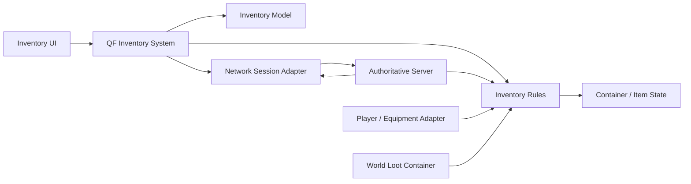

# Protocol_Evac 背包、QF 与服务器权威联机设计方案

## 一、文档目的

本文定义《Protocol_Evac》后续背包、项目级 QF 协作、HybridCLR 热更新与服务器权威联机的共同边界。

目标不是复刻某个游戏的全部系统，而是先完成一套“类三角洲”网格背包的可扩展玩法基础：

```text
物品实例
-> 网格容器
-> 拖放、旋转、堆叠与跨容器移动
-> 战利品与装备
-> 存档
-> 服务端权威校验与同步
```

本文不替代：

- `../战斗系统/战斗系统总开发文档.md`：Combat、Player 与 Enemy 的长期开发边界
- `../玩家状态与敌人AI/` 下的设计文档：Player HFSM、Skill 与 Enemy AI 细节
- `../AI归档记录/`：每次实际开发的变更、资源和验证记录

冲突时，以当前已验证的代码、Prefab、Scene 和最新归档为准。

## 二、已确认的方向

### 1. QF 是项目外层框架

QF 继续保留并扩展为项目级架构入口。当前 `GameArchitecture` 只注册了 `TimerSystem`，后续可以在此基础上增加背包、存档、流程和网络会话等项目级模块。

QF 负责：

```text
GameApp 启动与全局生命周期
项目流程：启动、热更、登录、大厅、进局、结算
长期数据与本地存档
跨模块命令、查询与事件
全局服务的装配
```

QF 不负责：

```text
Player HFSM 的每帧状态逻辑
Skill 时间轴
网格背包的坐标、占格、旋转与堆叠算法
CombatHitbox 的命中检测
Enemy BT、Utility 与寻路决策
服务器 Tick 内的高频玩法模拟
```

### 2. Player、Combat 与 Enemy 继续保持玩法独立

现有 Player 模块没有深度使用 QF，这是正确边界，后续不要求为统一形式而重构。

```text
QF 外层
└─ 负责项目流程与跨模块协作

玩法模块
├─ Player：HFSM、Transition、Skill、Motor、表现
├─ Inventory：网格规则、容器和物品操作
├─ Combat：DamageData、IDamageable、Hitbox
└─ Enemy：Sensor、Utility、BT、PathAgent
```

QF 与玩法模块交互时，由对应的 QF System、Controller 或场景适配层调用纯玩法接口；玩法规则本身不继承 QF 类型。

### 3. 联机采用服务器权威 Tick

已确认不采用 P2P 传统锁步。服务器是玩法状态的唯一权威来源：

```text
客户端
├─ 采集输入
├─ 为移动、镜头和局部表现做预测
├─ 提交输入与背包操作请求
└─ 接收服务器快照、事件和操作结果

服务器
├─ 按固定 Tick 推进玩法状态
├─ 校验移动、攻击、命中、掉落和背包操作
├─ 运行 Enemy AI
└─ 广播快照与可靠结果
```

当前 Player 的 `CharacterController`、Root Motion 和 Physics 命中检测可以继续服务单机与服务器模拟。联网后，客户端只把本地表现当作预测，最终命中和物品归属以服务器结果为准。

### 4. HybridCLR 的定位

HybridCLR 用于提升对局外流程、UI 和非权威玩法代码的更新能力，不用于在对局中改变确定的玩法版本。

```text
允许热更的时机
├─ 启动
├─ 登录 / 大厅
└─ 进入对局前版本检查

禁止热更的时机
└─ 已开始的联机对局
```

网络协议、稳定 Id、背包命令格式、存档格式和服务器 Tick 规则必须版本化；进入同一对局的客户端与服务器必须使用兼容版本。

### 5. 当前不引入 ECS

背包、Player HFSM、第一版 Enemy AI 都不是 ECS 的收益场景。只有在大量同类实体、投射物或感知对象成为明确性能瓶颈时，再单独评估局部 ECS 化。

## 三、总体架构



核心原则：

```text
UI 不直接修改背包数据
Inventory Rules 不依赖 QF、UI 或网络库
QF Inventory System 协调本地规则、存档和网络请求
服务器最终决定背包状态
Player 只读取装备和负重等已确认结果，不拥有网格规则
```

## 四、QF 接入设计

### 1. 当前入口的扩展方式

当前 `GameArchitecture` 已注册 `TimerSystem`。后续按真实需求注册，不一次性预建空系统：

```text
第一阶段
├─ InventoryModel
└─ InventorySystem

联机阶段
├─ NetworkSessionSystem
└─ MatchFlowSystem

热更阶段
└─ HotUpdateSystem
```

各模块的职责：

| QF 类型 | 背包侧职责 | 不承担的职责 |
| --- | --- | --- |
| `InventoryModel` | 保存客户端已确认的背包快照、容器版本和持久化数据 | 网格校验、网络发送、UI 拖拽 |
| `InventorySystem` | 调用规则层、写入 Model、发起存档或联网请求 | 直接绘制格子、直接修改 ItemView |
| `InventoryCommand` | 表达一次跨 UI / 存档 / 网络边界的操作请求 | 承载所有网格算法 |
| QF Event | 通知背包状态已确认、战利品容器变化、装备结果变化 | 高频拖拽位置、每帧 UI 刷新 |

`InventorySystem` 可以使用构造或初始化参数持有 `InventoryRules`，但 `InventoryRules` 不应反向获取 QF Architecture。

### 2. QTower 的处理

现有 `QTower` 继续服务已接入的 Player Controller 生命周期。背包第一版不强制使用 `QTower.EventManager`；优先通过 QF 的明确 Command / Event 或 UI 局部回调协作。

不要为了“统一事件系统”同时让一个背包操作经过 QTower Event、QF Event 和网络事件三次转发。

## 五、背包领域模型

### 1. 静态物品定义

每种物品使用一个 `ItemDefinitionConfigSO`，只保存可配置的静态事实：

```text
ItemId：稳定数值 Id，不使用资源 GUID 作为联机协议 Id
ItemCategory：武器、弹药、医疗、护甲、任务物品等
Tags：容器和装备槽准入标签
GridWidth / GridHeight：未旋转占格尺寸
CanRotate：是否允许旋转
MaxStackCount：最大堆叠数
UnitWeight：单件重量
Icon / Prefab / DisplayName：表现资源
```

`ItemId` 一旦用于存档或网络协议后不再复用。

### 2. 运行时物品实例

`InventoryItemInstanceData` 表示一件实际拥有的物品：

```text
ItemInstanceId：服务端分配的稳定实例 Id
ItemId：指向静态定义
StackCount：当前堆叠数
Durability：耐久度，第一版可不启用
CustomData：后续武器配件、弹匣内容等扩展数据
```

第一版不实现嵌套容器、随机词条、附件树或弹匣逐发装填，但实例 Id 和扩展数据入口需要预留。

### 3. 容器与摆放

```text
InventoryContainerConfigSO
├─ ContainerType
├─ GridWidth / GridHeight
├─ MaxWeight
└─ AcceptedTags

InventoryContainerData
├─ ContainerId
├─ ContainerVersion
├─ ConfigId
└─ Placements

InventoryPlacementData
├─ ItemInstanceId
├─ GridX / GridY
└─ IsRotated
```

网格坐标全部使用整数格，不以 UI 像素或世界坐标作为物品摆放的权威数据。

### 4. 第一版容器范围

按阶段加入，不要求首版全部完成：

| 阶段 | 容器 | 用途 |
| --- | --- | --- |
| I0 | 背包、测试战利品容器 | 网格、旋转、堆叠、跨容器移动 |
| I1 | 口袋、胸挂、装备槽 | 类三角洲的携带结构 |
| I2 | 世界战利品容器 | 与场景交互、多人争夺 |
| I3 | 特殊容器、嵌套容器 | 安全箱、背包内小包等扩展 |

装备槽与网格容器分开处理：装备槽只接受符合类型和标签的一件实例，不强行伪装成 1x1 网格。

## 六、背包操作契约

### 1. 所有状态改变都使用命令

第一版需要支持：

```text
Move：移动到另一位置或另一容器
Rotate：旋转物品
Split：从一堆物品分离数量
Merge：合并同类堆叠
Swap：交换两个占用位置
Equip / Unequip：装备或卸下
Loot：从战利品容器转移
Drop：丢到世界
```

一个命令至少需要：

```text
CommandSequence
SourceContainerId / TargetContainerId
ItemInstanceId
SourcePosition / TargetPosition
IsRotated
RequestedCount
ExpectedSourceVersion / ExpectedTargetVersion
```

### 2. 规则层校验顺序

```text
1. 命令格式和实例 Id 是否有效
2. 调用方是否拥有源容器操作权限
3. 源容器版本是否仍匹配
4. 物品是否仍在声明的源位置
5. 目标容器是否接受该物品标签
6. 目标位置是否越界或重叠
7. 堆叠、拆分和交换是否满足数量规则
8. 重量、容量和装备限制是否满足
9. 原子性写入状态并递增受影响容器版本
```

任何一步失败都不得留下半移动状态。规则层返回 `InventoryCommandResultData`，其中包含成功或失败原因、受影响容器的新版本和必要状态差量。

### 3. 重量与携带能力

第一版总重量为所有容器内实例重量之和：

```text
TotalWeight = Sum(UnitWeight * StackCount)
```

负重对 Player 的影响不在背包规则层直接处理。由装备适配层读取确认后的重量，再决定是否写入 Player 的移动修正数据。具体超重曲线、不能移动阈值和丢弃规则后续确认。

## 七、UI 与交互设计

### 1. UI 只表现已确认状态和局部预览

```text
已确认状态：来自 InventoryModel 的容器快照
拖拽预览：临时显示，不写入权威数据
离线模式：规则层成功后立即更新 Model
联机模式：等待服务器结果后更新 Model
```

界面至少包含：

```text
玩家携带容器
目标战利品容器
物品图标、堆叠数、旋转状态
格子占用与有效 / 无效落点反馈
总负重和容器容量信息
```

第一版不要求做完整美术和动画。先保证拖放、旋转、拆分、合并与拒绝反馈正确。

### 2. 装备与 Player 表现

装备操作成功后，由装备适配层将已确认的装备实例映射到 Player 表现和属性。

```text
Inventory Rules
-> InventorySystem
-> Equipment Adapter
-> Player 表现 / 属性读取
```

不要让背包 UI 直接切换 `PlayerWeaponController`。武器显隐仍由 Player 的运行时状态决定；背包只决定“当前拥有和装备的是哪件武器”。

## 八、服务器权威联机设计

### 1. 输入和状态同步

网络传输框架尚未最终选定。无论使用何种实现，必须保持以下语义：

```text
客户端 -> 服务器：输入命令、背包命令、交互请求
服务器 -> 客户端：状态快照、可靠操作结果、战斗事件
服务器：唯一修改权威背包、掉落、生命和 Enemy 状态
```

客户端可以预测移动、开火表现和拖拽落点，但不得在未确认前将物品操作视为最终成功。

### 2. 联机背包流程

```text
客户端拖拽物品
-> 构造 InventoryCommandData
-> 发送给服务器
-> 服务器执行 InventoryRules
-> 成功：递增容器版本并广播差量
-> 失败：返回拒绝原因和最新状态
-> 客户端更新 InventoryModel 与 UI
```

当两个客户端争夺同一战利品时，先被服务器接受的命令获得最新容器版本；后到命令因版本不匹配而被拒绝并刷新。

### 3. Combat 与 Enemy 的联机边界

```text
客户端：攻击输入与局部表现预测
服务器：Skill 时间窗、命中、DamageData、生命和死亡裁定
Enemy AI：仅服务器运行
客户端：接收 Enemy 状态和战斗结果
```

当前单机 `CombatHitbox` 完成 Player 命中竖切后，后续再增加服务器权威适配。不要在背包第一版中同时改造 Player Combat 网络逻辑。

### 4. Tick 频率

服务器 Tick 频率暂不在文档中写死。应先完成单服务器、两客户端的移动和背包命令原型，再基于操作手感、带宽和服务器负载确定 30 或 60 Tick 等具体数值。

## 九、HybridCLR 与程序集边界

### 1. 先建立边界，再接入工具链

在安装 HybridCLR 前，先将代码按稳定性分层：

```text
AOT 基础层
├─ GameApp、QF 基础框架与启动
├─ 网络协议和序列化
├─ 物品 / 容器稳定 Id 与存档 DTO
├─ 对局 Tick 与权威规则接口
└─ Unity 场景与网络桥接

Hotfix 候选层
├─ 对局外流程
├─ 背包 UI 与 Presenter
├─ 活动和非权威表现逻辑
└─ 已完成兼容性验证的玩法扩展
```

背包规则第一版先放在 AOT 基础层，直到本地和双客户端验证完成。后续若迁入热更层，必须保证服务器和进入同一对局的客户端版本一致。

### 2. 热更新验收原型

HybridCLR 接入的最小验证目标：

```text
启动时加载热更程序集
进入背包界面并运行一段热更 UI 逻辑
重启后完成版本检查、下载、加载与回退
联机对局开始后禁止切换玩法程序集版本
```

资源加载方案与具体网络传输框架在进入 HybridCLR 接入前确认。本文不默认引入额外资源或网络插件。

## 十、实施路线与验收

| 阶段 | 交付 | 验收 |
| --- | --- | --- |
| F0 | QF 背包入口设计 | `InventoryModel`、`InventorySystem` 只承担外层职责，无网格算法复制 |
| I0 | 背包纯规则层 | 两容器间移动、旋转、堆叠、拆分均通过 EditMode 测试 |
| I1 | 本地背包 UI | 拖拽预览正确，失败操作不改变确认状态 |
| I2 | 装备、负重、世界战利品 | 装备映射不直接控制 Player 战斗状态，战利品可转移 |
| I3 | 存档与版本迁移 | 重启后物品、坐标、旋转、堆叠一致，旧存档可报明确错误 |
| H0 | HybridCLR 兼容性原型 | 对局外热更程序集可加载，进入对局前可校验版本 |
| N0 | 双客户端命令回环 | 服务器接受 / 拒绝背包命令后，两端状态一致 |
| N1 | 服务器权威世界战利品 | 并发争夺同一物品只成功一次，失败端收到刷新 |
| N2 | Combat / Enemy 网络适配 | 命中和 Enemy 决策均以服务器结果为准 |

## 十一、当前待确认项

### 1. 第一版场景敌对 AI 已确认规则

项目以 PVP 为主要资源竞争来源，同时加入一个服务器权威的敌对 AI，作为场景压力与 Behavior Tree 技术竖切。它不发展为刷怪、波次或独立 PVE 经济系统。

```text
场景中手动放置一个 AI
AI 可巡逻、发现、追击、搜索和近战攻击玩家
AI 只选择已发现且当前可见的玩家作为新目标
首次发现多个可见玩家时，选择最近目标
已持有目标后，直到目标死亡、不可见或超出行为范围才丢失
丢失目标后前往 LastSeenPosition 搜索，再回到巡逻
AI 与 Player 通过共享 Combat / DamageData / IDamageable 交互
AI 死亡后掉落普通战利品容器
不实现 AI 刷新、生成器、波次、仇恨表或高价值专属掉落
```

第一版行为树：

```text
Root Selector
├─ IsDead -> Dead
├─ HasTarget && IsTargetInAttackRange -> Attack
├─ HasTarget && CanSeeTarget -> Chase
├─ HasLastSeenPosition -> Search
└─ Patrol
```

所有 AI 决策、攻击窗口、死亡和掉落均由服务器裁定；客户端仅接收表现状态和结果。

### 2. 仍待确认的内容

以下决定会改变实现细节，开始对应阶段前必须确认：

```text
1. 网络传输框架：FishNet 是候选，尚未作为项目最终依赖安装
2. 一局最大玩家数与是否需要 Dedicated Server
3. 首版容器清单：是否包含安全箱、钥匙链、嵌套背包
4. 玩家死亡后的掉落规则、保险规则和拾取权限
5. 物品配置和热更资源的最终加载方案
6. 负重对移动、冲刺和战斗的具体影响
```

## 十二、下一步

下一项实际开发工作是 I0：先创建不依赖 UI、QF 和网络库的背包纯规则层，并建立 EditMode 测试。

开始 I0 前，优先确认首版物品类型和容器清单；其余网络、HybridCLR 与死亡掉落规则可保持待决，不阻塞本地网格背包竖切。
